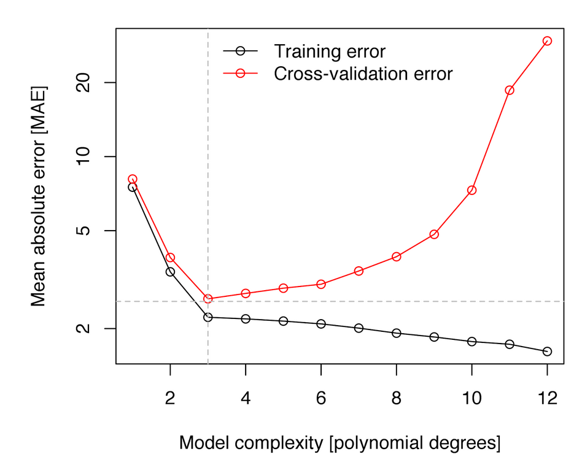
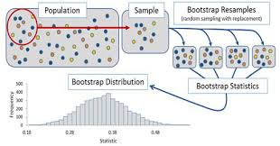

# Validación cruzada

La validación cruzada (CV por sus siglas en inglés) es la técnica que usamos para evaluar si un modelo está sobreajustado y para estimar cómo funcionará con nuevos datos.

El sobreajuste es un peligro importante en el análisis predictivo, especialmente cuando se utilizan algoritmos de aprendizaje automático que, sin el ajuste adecuado, puede aprender datos de nuestra muestra casi a la perfección, esencialmente ajustando el ruido (o variabilidad). Cuando se utiliza un modelo de este tipo para predecir nuevos datos, con un ruido (o variabilidad) diferente, el rendimiento del modelo puede ser sorprendentemente malo. Usamos CV para ayudarnos a identificar y evitar tales situaciones. ¿Cómo podemos hacer esto? Muchos algoritmos de aprendizaje automático requieren que el usuario especifique ciertos parámetros (hiper-parámetros). Veremos más adelante que, por ejemplo, necesitaremos especificar un valor para $m$ que corresponde al número de predictores elegidos al azar que se utilizarán en cada división de árbol cuando usemos "random forest" como algoritmo de aprendizaje. Cuanto menor sea $m$, más simple será el árbol. Podemos usar CV para elegir el valor de $m$ que minimiza la variación y reduce el sobreajuste. La regresión lineal no tiene parámetros que debe especificar el usuario, pero la CV aún nos ayuda a evaluar cuánto podría sobreajustarse un modelo a los datos de muestra.


De manera breve, los algoritmos de cross-validation se pueden resumir como:

   - Reserva una parte pequeña de los datos
   - Crea (o entrena) el modelo usando el resto de datos
   - Testa el modelo en los datos reservados.

A continuación se describen algunas de las distintas técnicas de validación cruzada que existen.


## Validación en un conjunto de datos externo

La versión más simple de CV es el llamado método de conjunto de validación, que consta de los siguientes pasos:


1. *Dividir los datos de la muestra en dos partes: un conjunto de entrenamiento y otro de validacións.* Los investigadores usan diferentes proporciones, pero es común seleccionar al azar el 70% de los datos como conjunto de entrenamiento y el 30% como conjunto de prueba o validación. . (Obviamente, debemos tener suficientes datos en la muestra para ajustar un modelo después de dividir los datos). Debido a que CV se basa en un muestreo aleatorio, nuestros resultados variarán a menos que usemos `set.seed ()`. 

Demostraremos usando los datos de Hitters, que es un estudio sobre bateadores de USA donde se pretende crear un modelo que prediga el salario que tendría un jugador en función de sus habilidades. La variable de interés es el salario (`Salary`) y como es una variable continua usaremos un modelo de regresión lineal para ilustrar el concepto de validación cruzada ya que este modelo es conocido de otros cursos anteriores. 

Es importante notar que para el aprendizaje automático necesitamos que nuestra base de datos teng casos completos. Es decir, es importante no tener missings (existen métodos para imputar datos pero está fuera de lo que cubre este curso). Los datos están en la librería ISLR que se puede instalar de CRAN. También cargamos la libería `tidyverse` que nos hará falta para el manejo de datos

```{r}
library(arm)
library(tidyverse)
library(ISLR)
set.seed(123) # para que los resultados sean comparables entre ordenadores
Hitters_complete <- Hitters[complete.cases(Hitters), ]
rows <- sample(nrow(Hitters_complete), .7 * nrow(Hitters_complete))
train <- Hitters_complete[rows, ]
test <- Hitters_complete[-rows, ]
```

2. *Ajustar un modelo en el conjunto de entrenamiento* usando un procedimiento de selección de variables apropiado. Crearemos dos modelos para comparar: uno con todas las variables, luego otro con solo las variables elegidas por `regsubsets ()`.

```{r}
full_model <- lm(Salary ~., data = train)
select_model <- lm(Salary ~ AtBat + Hits + Walks + CRBI + Division + PutOuts, data = train)
```

3. *Utilizar ese modelo para predecir en el conjunto de prueba.* El rendimiento en el conjunto de prueba es la estimación de CV para el rendimiento fuera de la muestra del modelo. Para ello se puede usar cualquier medida de ajuste, que para los modelos lineales puede ser el `rmse` (root mean square error). Veremos más adelante otras medidas de ajuste cuando nuestra variable de interés es categórica (e.g. caso/control, responde/no responde, ...)


```{r}
rmse <- function(fitted, actual){
  sqrt(mean((fitted - actual)^2))
}

results <- data.frame(Model = c("Modelo completo muestra entrenamiento",
                                "Modelo seleccionado muestra entrenamiento",
                                "Modelo completo muestra validación",
                                "Modelo seleccionado muestra validación"),
                      RMSE = round(c(rmse(fitted(full_model), train$Salary),
                               rmse(fitted(select_model), train$Salary),
                               rmse(predict(full_model, newdata = test), test$Salary), 
                               rmse(predict(select_model, newdata = test), test$Salary)),1))
results
```


Podemos ver que el modelo completo está sobreajustado --- el RMSE dentro de la muestra es mejor que el RMSE fuera de muestra --- mientras que el modelo seleccionado elegido por `regsubsets ()` usando BIC no está sobreajustado. De hecho, el modelo seleccionado funciona mucho mejor fuera de la muestra que dentro de la muestra, aunque este resultado en particular es probablemente una cuestión de azar, una función de división aleatoria que estamos usando. Sin embargo, en general, estos resultados ilustran el peligro de la complejidad del modelo y por qué tiene sentido elegir predictores utilizando medidas de ajuste del modelo que penalicen la complejidad. Los modelos simples tienden a generalizar mejor. Esta figura muestra estas relaciones:


## Leave-one-out cross validation (LOOCV)

Este método funciona de la siguiente manera:


   - Extrae una observación de los datos y usa el resto para entrenar el modelo
   - Testa el modelo con la observación que ha sido extraída en el paso anterior y guarda el error asociado a esa predicción
   - Repite el proceso para todos los puntos
   - Calcula el error de predicción global usando el promedio de todos los errores estimados en el paso 2.


Veremos más adelante cómo hacer estos cálculos con una libería específica. Aquellos que tengáis un nivel medio/alto de R quizás os podríais plantear este ejercicio (no es obligatorio - pondré la solución en moodle)

-----------------------------------------------------
**EJERCICIO (no obligatorio)**:

Crea una función R que lleve a cabo el procedimiento de LOOCV y estima el valor de LOOCV para el modelo completo (`full_model`) y el modelo seleccionado (`select_model`) del ejemplo anterior.
-----------------------------------------------------


## K-fold cross validation (K-fold CV)


La diferencia con LOOCV es que este método evalúa el comportamiento del modelo en un conjunto de datos de distingo tamaño (K). El algoritmo es el siguiente:

   - Separa los datos en k-subconjuntos (k-fold) de forma aleatoria
   - Guarda uno de los subconjuntos de datos y entrena el modelo con el resto de individuos
   - Testa el modelo con los datos resevados y guarda el error de predicción promedio.
   - Repite el proceso hasta que los k subconjuntos hayan servido de muestra test.
   - Calcula el promedio de los k errores que han sido guardados. Este valor es el error de cross-validación y nos sirve para evaluar el comportamiento de nuestro modelo como si lo usáramos en una base de datos externa.


La principal ventaja de este método respecto a LOOCV es el coste computacional. Otra ventaja que no es tan obvia, es que este método a menudo da mejores estimaciones del error del modelo que LOOCV^[James et al. 2014].

Una pregunta típica es cómo se escoje el valor óptimo de K. Valores pequeños de K da estimaciones sesgadas. Por otro lado, valores grandes de K están menos sesgados, pero tienen mucha variabilidad. En la práctica, normalmente se usan valores de k = 5 or k = 10, ya que estos valores se han mostrado de forma empírica como los que tienen tasas de error estimadas no demasiado sesgadas ni con mucha varianza.

Al igual que en el caso anterior veremos unas liberías adecuadas para hacer estos análisis de forma eficiente. De momento se pòdría realizar el siguiente ejercicio (pondré la solución - no es obligatorio):


-----------------------------------------------------
**EJERCICIO  (no obligatorio)**:

Crea una función R que lleve a cabo el procedimiento de K-fold CV y estima el valor de K-fold CV para el modelo completo (`full_model`) y el modelo seleccionado (`select_model`) del ejemplo anterior. Haz que la función tenga un parámetro que dependa de K, y da los resultados para K=5 y K=10.
-----------------------------------------------------

## Uso de CV para estimar el hiper-parámetro

Si el algoritmo de aprendizaje automático que vamos a utilizar para realizar predicciones tiene un parámetro que controla el comportamiento (por ejemplo grado de polinomio en regresión no lineal, o el número de nodos en árboles de clasificación) éste podría elegirse de forma que minimizara el error de clasificación. Esta selección también puede dar problemas de sobre ajuste ya que podríamos seleccionar de forma que ajustara perféctamente a nuestros datos. 

Para evitar el problema, se puede utilizar cualquiera de las técnicas vistas con anterioridad. Aquí tenemos un ejemplo donde se ha usado un modelo de aprendizaje que se basa en introducir términos polinómicos de varaibles para realizar una mejor predicción mediante regresión lineal usando sólo términos lineales. 

{width=60%}

## Uso de bootstrap 

Si en vez de partir nuestra muestra en $K$ submuestras, realizamos una selección aleatoria de muestras con reemplazamiento, nos encontraremos ante una aproximación de tipo *bootstrap* que es una técnica muy usada en estadística para hacer inferencia cuando la distribución del estadístico es desconocida basada en el remuestreo [[aquí](https://biocosas.github.io/R/100_bootstrap.html) tenéis una descripción sencilla de esta metodología]. 

{width=60%}

{width=60%}


De manera que el procedimiento *bootstrap* aplicado a regresión sería:

  - Sacar una muestra aleatoria con remplazamiento de tamaño $n$ de nuestros datos (tenemos $n$ observaciones)
  - Guardar las muestras que no han sido seleccionadas (datos de prueba)
  - Entrena el modelo con la muestra *bootstrap*
  - Testa el modelo con los datos de prueba y guarda el error de predicción promedio.
  - Repite el proceso $B$ veces 
  - Calcula el promedio de los $B$ errores que han sido guardados. Este valor es el error *bootstrap* y nos sirve para evaluar el comportamiento de nuestro modelo.


## Imputación de datos faltantes  (Información extra para los que venís al curso)

La mayoría de métodos para aprendizaje automático requiren casos completos. Sin embargo, los datos reales a menudo tienen observaciones faltantes. La función `lm ()`, analiza casos completos sin indicar nada al usuario, pero ... ¿Deberíamos eliminar estas filas o imputar las observaciones que faltan? Casi siempre es mejor imputar, aunque, en la práctica puede que no valga la pena imputar algunas observaciones faltantes, ya que eliminarlas no suele cambiar el ajuste en absoluto. La imputación de datos faltantes es un tema extenso y complicado; aquí haremos una breve introducción y discutiremos los principales temas a tener en cuenta.

Tipos de valores perdidos:

- *Falta completamente al azar (MCAR por sus siglas en inglés)*: la probabilidad de que falte una observación es la misma para todos los casos. Eliminar los casos que faltan en esta instancia no causará sesgos, aunque es posible que perdamos información.

- *Missing at random (MAR pos sus siglas en inglés)*: la probabilidad de que falte una observación depende de un mecanismo conocido. Por ejemplo, es menos probable que algunos grupos respondan encuestas. Si conocemos la pertenencia a un grupo, podemos eliminar las observaciones faltantes siempre que incluyamos el grupo como factor en una regresión. Sin embargo, generalmente podemos hacer algo mejor que simplemente eliminar estos casos.

- *Missing not at random (MNAR por sus siglas en inglés) *: la probabilidad de que falte una observación depende de algún mecanismo desconocido --- una variable no observada. Tratar los problemas del MNAR es difícil o incluso imposible.


Nos centraremos en los problemas MAR. Una solución simple es completar o *imputar* los valores MAR. Hay dos estrategias principales:

**Imputación simple** reemplaza los valores perdidos según una estadística univariante o un modelo de regresión multivariable. Existen muchas librerías que implementan diferentes métodos (en este curso veremos algunas). En la imputación con medianas imputamos los datos faltantes usando la mediana de la variable que presenta datos faltantes (La mediana es mejor que la media cuando los datos de la columna están sesgados). Podemos imputar también usando KNN o *random forest* creando un modelo multivariante de las observaciones faltantes usando otras variables y usar ese modelo para predecir los valores faltantes.

El problema con la imputación simple, teóricamente, es que la variabilidad de la variable imputada es menor de lo que habría sido la variabilidad en la variable real, creando un sesgo hacia 0 en los coeficientes. Por tanto, mientras que la eliminación pierde información, la imputación única puede provocar sesgos. (Sin embargo, no me queda claro cuán grande es este problema en la práctica).


La **imputación múltiple** aborda estos problemas imputando los valores faltantes con un modelo multivariante, pero agregando la variabilidad de nuevo al volver a incluir la variación del error que normalmente veríamos en los datos. El término "múltiple" en la imputación múltiple se refiere a los múltiples conjuntos de datos creados en el proceso de estimación de los coeficientes de regresión. Los pasos son los siguientes:

1. Crear $m$ conjuntos de datos completos con valores perdidos imputados. Las imputaciones se realizan extrayendo aleatoriamente distribuciones de valores plausibles para cada vector de columna (variables).

2. Ajustar un modelo lineal en cada conjunto de datos imputados y almacene $\hat \beta$s y SE.

3. Promediar los $\hat \beta$s y combinar los SE para producir coeficientes basados en múltiples conjuntos de datos imputados. Específicamente, 

$$\hat \beta_ {j} = \frac {1} {m} \sum_ {i} \hat \beta_ {ij}$$
y

$$s ^ 2_j = \frac {1} {m} \sum_{i} s^2_{ij} + var \hat \beta_ {ij} (1 + 1 / m),$$ 

donde $\hat \beta_{ij}$ y $s_{ij}$ son las estimaciones y los errores estándar del resultado imputado $i^{th}$ para $i=1, ..., m$ y para el parámetro $j^{th}$.

La imputación múltiple funciona mejor para la descripción que para la predicción, y probablemente sea preferible a la imputación única si sólo queremos estimar coeficientes. Para la predicción (como es el caso del aprendizaje automático), normalmente bastará con utilizar imputación simple.

Demostraremos métodos de imputación utilizando los datos de Carseats del paquete ISLR. Este es un conjunto de datos simulado de ventas de asientos de coche, del cual eliminaremos aleatoriamente el 25% de las observaciones usando la función `prodNA ()` en el paquete `missForest` (teniendo cuidado de dejar la variable de resultado, Sales, intacta).


```{r}
library(missForest)
data(Carseats, package="ISLR")
levels(Carseats$ShelveLoc) <- c("Bad","Medium","Good") # Reordenamos los niveles de la variable

set.seed(123)
carseats_missx <- prodNA(Carseats[,-1], noNA=.25)
carseats_miss <- cbind(Sales=Carseats[, 1], carseats_missx)
glimpse(carseats_miss)
```

Observamos que hay datos faltantes. Podemos tener una estadística global de la falta de información que hay en nuestros tanto de forma numérica mediante la librería `skimr`: 

```{r}
skimr::skim(carseats_miss)
```

Comprobamos como la falta de información en las variables (excepto 'Sales') es de aproximadamente el 25% (columna `complete_rate` ~ 75%). Pero si tuviéramos que analizar datos de dos o más covariables, el porcentaje de datos completos disminuiría radicalmente. 

```{r}
# Total de individuos
nrow(carseats_miss)

# Total de individuos con casos completos
carseats_miss %>% complete.cases() %>% sum()
```

Es decir, si tuviéramos que estimar un modelo con todas las variables de nuestra base de datos sólo dispondríamos de información efectiva para 23 individuos del total de 400. 

La librería `VIM` nos puede ayudar a tener esta información de forma gráfica:

```{r}
library(VIM)
aggr(carseats_miss)
```


Ahora faltan muchas observaciones. Cuando ajustamos un modelo de regresión para la variable Sales observamos que `lm ()` analiza casos completos y se estima un modelo basado en un subconjunto muy pequeño de datos.

```{r}
lm(Sales ~ CompPrice + Income + Advertising + Population + Price, data = carseats_miss)
```

Sólo tenemos 93 observaciones de las 400 originales! Demostraremos la imputación múltiple usando la función `mice ()` de la librería `mice`.  

```{r}
library(mice)
names(Carseats)
carseats_imp <- mice(carseats_miss, printFlag = F)
```

El objeto `carseats_imp` incluye (entre muchas otras cosas) $m$ conjuntos de datos imputados (la configuración predeterminada es $m$ = 5). Los conjuntos de datos imputados difieren porque las imputaciones se extraen aleatoriamente de distribuciones de valores plausibles. Podemos visualizar la variabilidad de los predictores en estos conjuntos de datos imputados usando la función `densityplot ()`.


```{r}
library(lattice)
densityplot(carseats_imp)
```

Las líneas azules continuas representan la distribución real de los predictores, mientras que las líneas rojas muestran las distribuciones imputadas. El siguiente paso es usar estos conjuntos de datos imputados para promediar los $\beta$s y los SE utilizando la función `pool ()` de la librería `mice`.


```{r}
carseats_model_imp <- with(data = carseats_imp, 
     exp = lm(Sales ~ CompPrice + Income + Advertising + Population + Price))
mi <- summary(pool(carseats_model_imp))
```


Estos coeficientes son similares a los del modelo anterior ajustado utilizando los datos no imputados, pero deberían estar más cerca de los valores de la población porque, en lugar de simplemente eliminar los casos incompletos, utiliza información de distribución para hacer suposiciones fundamentadas sobre los datos faltantes. La imputación múltiple funciona mejor para fines de descripción --- estimar coeficientes para informar en un artículo académico, por ejemplo --- pero usarla para predecir nuevos datos es incómodo o imposible, por las siguientes razones:

- Si los nuevos datos están completos, podemos utilizar las estimaciones de coeficientes derivadas de la imputación múltiple en una ecuación de regresión para la predicción. Pero esto es difícil ya que hay que hacerlo manualmente. Usamos los datos originales de Carseats como ilustración.


```{r}
preds <- mi[1, 2] + 
  mi[2, 2]*Carseats$CompPrice +
  mi[3, 2]*Carseats$Income +
  mi[4, 2]*Carseats$Advertising +
  mi[5, 2]*Carseats$Population +
  mi[6, 2]*Carseats$Price
  
   
head(preds)
```

- Si los nuevos datos no están completos, entonces estos coeficientes imputados son inútiles para predecir en filas con observaciones faltantes. Esto, por ejemplo, es el resultado de intentar predecir utilizando los datos con observaciones faltantes.


```{r}
preds <- mi[1, 2] + 
  mi[2, 2]*carseats_miss$CompPrice +
  mi[3, 2]*carseats_miss$Income +
  mi[4, 2]*carseats_miss$Advertising +
  mi[5, 2]*carseats_miss$Population +
  mi[6, 2]*carseats_miss$Price
  
   
head(preds)
```


- La imputación múltiple, por lo tanto, no resuelve el principal problema al que nos enfrentamos a menudo con los datos faltantes, que es que, aunque hayamos ajustado con éxito un modelo en nuestros datos, el conjunto de validación también puede tener observaciones faltantes, y nuestras predicciones utilizando esos datos puede no poder realizarse.

- Podríamos usar uno de los conjuntos de datos imputados, pero entonces ya no estamos haciendo imputación múltiple sino imputación simple. En ese momento, los métodos disponibles en el paquete `mice` ya no ofrecen ninguna ventaja especial sobre los de los paquetes `caret` y `missForest`. De hecho, podrían ser peores ya que la función `mice ()` no fue diseñado para producir la mejor imputación individual, sino más bien una gama de imputaciones plausibles.

Usando `caret`, podemos hacer una imputación simple usando knnImpute, medianImpute o bagImpute. Estos métodos solo funcionan para variables numéricas, por lo que crearemos una función personalizada para convertir los factores --- Shelveloc, Urban y US --- en números enteros. (Al usar el conjunto de datos imputados para la regresión, podríamos dejar estas variables como números enteros, siempre que los valores enteros correspondan a los niveles de los factores).


```{r}
library(caret)
make_df_numeric <- function(df){
  data.frame(sapply(df, function(x) as.numeric(x)))
  }
carseats_miss_num <- make_df_numeric(carseats_miss)
med_imp <- predict(preProcess(carseats_miss_num, method = c("medianImpute")), carseats_miss_num)
knn_imp <- predict(preProcess(carseats_miss_num, method = c("knnImpute")), carseats_miss_num)
bag_imp <- predict(preProcess(carseats_miss_num, method = c("bagImpute")), carseats_miss_num)
```

El paquete `missForest` ofrece otra solución de imputación única, que es más simple que las funciones de `caret` porque maneja datos categóricos automáticamente. Si bien `missForest` funciona bien para conjuntos de datos pequeños y proporciona imputaciones de buena calidad, es muy lento en conjuntos de datos grandes. De hecho, lo mismo ocurrirá con la función `bagImpute ()` de `caret`. En tales casos, podría tener sentido usar la función `medianImpute ()` de `caret` en su lugar que es muy rápida.

```{r}
mf_imp <- missForest(carseats_miss, verbose = F)
```


Comparemos los errores asociados con estos diferentes métodos de imputación. Podemos hacer esto porque, habiendo creado las observaciones faltantes en primer lugar, podemos comparar las observaciones imputadas con las observaciones verdaderas calculando la suma de los cuadrados de la diferencia. Para las imputaciones usando `mice ()` calculamos los errores para cada uno de los 5 conjuntos de datos imputados. Los resultados de `knnImpute ()` no son comparables porque la función automáticamente centra y escala las variables y los hemos omitido.


```{r}
comparison <- data.frame(Method = c("mice 1", 
                                    "mice 2", 
                                    "mice 3", 
                                    "mice 4", 
                                    "mice 5", 
                                    "medianImpute", 
                                    "bagImpute", 
                                    "missForest"),
                         RMSE = c(rmse(make_df_numeric(complete(carseats_imp, 1)), make_df_numeric(Carseats)),
                                  rmse(make_df_numeric(complete(carseats_imp, 2)), make_df_numeric(Carseats)),
                                  rmse(make_df_numeric(complete(carseats_imp, 3)), make_df_numeric(Carseats)),
                                  rmse(make_df_numeric(complete(carseats_imp, 4)), make_df_numeric(Carseats)),
                                  rmse(make_df_numeric(complete(carseats_imp, 5)), make_df_numeric(Carseats)),
                                  rmse(med_imp, make_df_numeric(Carseats)),
                                  rmse(bag_imp, make_df_numeric(Carseats)),
                                  rmse(make_df_numeric(mf_imp$ximp), make_df_numeric(Carseats))))
                         
comparison %>%
  mutate(RMSE = round(RMSE)) %>%
  arrange(RMSE)
```


`missforest` obtiene los mejores resultados, aunque medianImpute compara muy bien. Los resultados de `mice` no son muy buenos, probablemente por las razones mencionadas anteriormente: está diseñado para una imputación múltiple, no simple.

