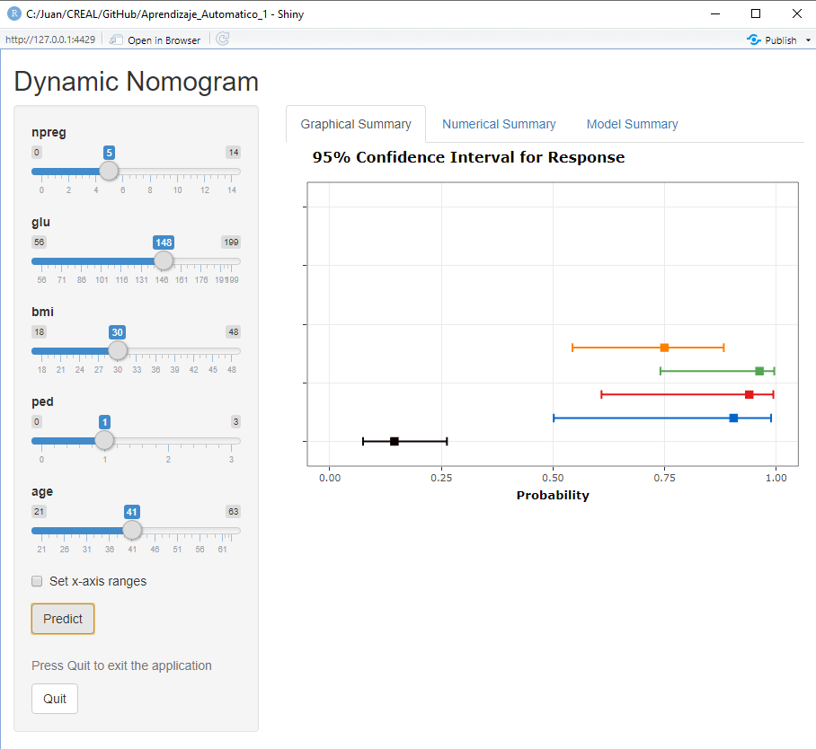

# Regresión logística

Este capítulo introduce la regresión logística como el método más sencillo para crear modelos predictivos en problemas de clasificación que es el principal objetivo del curso. Se cubrirán los siguientes temas:

- Conocer la función logística
- Cómo interpretar los coeficientes de los modelos 
- Cómo evaluar la capacidad predictiva de un modelo
- Cómo interpretar variables
- Ilustrar un ejemplo de análisis completo
- Aprender a hacer nomogramas fijos y dinámicos


Hasta ahora, nuestra variable de resultado era continua. Pero si la variable de resultado es binaria (0/1, "No"/"Sí"), entonces nos enfrentamos a un problema de *clasificación*. El objetivo de la clasificación es crear un modelo capaz de *clasificar* el resultado --- y, cuando se usa el modelo para la predicción, nuevas observaciones--- en una de dos categorías. La regresión logística se introduce en el contexto de la epidemiología como un modelo de regresión que extiende el modelo lineal cuando nuestra variable respuesta es binaria, pero tambié es, probablemente, el método estadístico más utilizado para la clasificación y el más sencillo. Una de las grandes ventajas de estos modelos respecto a otros que veremo más adelante es que este método produce un *modelo de probabilidad* para nuestra variable resultado. En otras palabras, los valores ajustados en un modelo logístico o logit no son binarios sino que son *probabilidades* que representan la probabilidad de que el resultado pertenezca a una de nuestras dos categorías.

Desafortunadamente, debemos afrontar nuevas complicaciones cuando trabajamos con regresión logística, lo que hace que estos modelos sean inherentemente más difíciles de interpretar que los modelos lineales. Las complicaciones surgen del hecho de que con la regresión logística modelamos la probabilidad de que $y$ = 1, y la probabilidad siempre se escala entre 0 y 1. Pero el predictor lineal, $X_i \beta$, oscila entre $\pm \infty$ (donde $X$ representa todos los predictores del modelo). Esta diferencia de escala requiere transformar la variable de resultado, lo cual se logra con la función logit:

$$
\text{logit}(x) = \text{log}\left( \frac{x}{1-x} \right)
$$

La función logit asigna el rango del resultado (0,1) al rango del predictor lineal $(-\infty, +\infty)$. El resultado transformado, $\text{logit} (x)$, se expresa en logaritmos de probabilidades ($\frac{x}{1-x}$ se conoce como probabilidades del resultado - razón de odds en inglés - momios en castellano). Así que el modelo también se puede escribir como:

$$\text{Pr}(y_i = 1) = p_i$$ 

$$\text{logit}(p_i) =  X_i\beta$$ 
 
 
Las probabilidades logarítmicas (e.g. el log-odds) no tienen interpretación (que no sea el signo y la magnitud) y deben transformarse nuevamente en cantidades interpretables, ya sea en *probabilidades*, usando el logit inverso, o en *razones de probabilidades*, mediante el uso de la función exponencial. Discutimos ambas transformaciones a continuación. 


## La función logit inversa
El modelo logístico se puede escribir, alternativamente, usando el logit inverso:

$$
\operatorname{Pr}(y_i = 1 | X_i) = \operatorname{logit}^{-1}(X_i \beta)
$$ 

donde $y_i$ es la respuesta binaria, $\operatorname{logit}^{- 1}$ es la función logit inversa y $X_i \beta$ es el predictor lineal. Podemos interpretar esta formulación diciendo que la probabilidad de que $y = 1$ es igual al logit inverso del predictor lineal $(X_i, \ beta)$. Por lo tanto, podemos expresar los valores ajustados del modelo logístico y los coeficientes como probabilidades utilizando la transformación logit inversa. Pero, ¿qué es exactamente el logit inverso? Pues es:

$$\operatorname{logit}^{-1}(x) = \frac{e^{x}}{1 + e^{x}}$$

donde $e$ es la función exponencial.

Podemos tener una idea de cómo la función logit inversa transforma el predictor lineal mediante una gráfica. Aquí usamos un rango arbitrario de valores de x en (-6, 6) para demostrar la transformación.


```{r}
x <- seq(-6, 6, .01)
y <- exp(x)/(1 + exp(x))
ggplot(data.frame(x = x, y = y), aes(x, y)) +
  geom_line() + 
  ylab(expression(paste(logit^-1,"(x)"))) +
  ggtitle(expression(paste("y = ", logit^-1,"(x)")))
```

Los valores $x$, que van de -6 a 6, son comprimidos por la función logit inversa en el rango 0-1. El logit inverso es curvo, por lo que la diferencia esperada en $y$ correspondiente a una diferencia fija en $x$ no es constante. A valores bajos y valores altos de $x$, un cambio de unidad corresponde a un cambio muy pequeño en $y$, mientras que en la mitad de la curva un pequeño cambio en $x$ corresponde a un cambio relativamente grande en $y$. En la regresión lineal, la diferencia esperada en $y$ correspondiente a una diferencia fija en $x$ es, por el contrario, constante. *Por lo tanto, cuando interpretamos los resultados logísticos debemos elegir en qué parte de la curva queremos evaluar la probabilidad del resultado, dado el modelo.*


## Ejemplo de regresión logística

Ilustremos estos conceptos utilizando el conjunto de datos "Default" del ISLR. Este conjunto de datos simulado contiene una variable binaria que representa el incumplimiento en los pagos de la tarjeta de crédito (variable "default"), que modelaremos como una función de la variable  "balance" (la cantidad de deuda que tiene la tarjeta) y la variable "income" (ingresos). 

Los datos pueden obtenerse mediante

```{r}
library(ISLR)
data(Default)
str(Default)
```


Antes de Primero visualizaremos cómo es esta relación.

```{r}
library(gridExtra)

ggplot(Default, aes(x = balance, y = income, col = default)) +
  geom_point(alpha = .4) +
  ggtitle("Balance vs. Income by Default")

grid.arrange(
ggplot(Default, aes(default, balance)) + 
  geom_boxplot() +
  ggtitle("Balance by Default") + 
  ylab("balance"),
ggplot(Default, aes(default, income)) + 
  geom_boxplot() +
  ggtitle("Income by Default") + 
  ylab("income"),
ncol = 2)
```


Claramente, los valores altos de saldo están asociados con el incumplimiento en todos los niveles de ingresos. Esto sugiere que los ingresos en realidad no son un fuerte predictor de incumplimiento, en comparación con el saldo, que es exactamente lo que vemos en los diagramas de cajas.


Exploremos estas relaciones usando la regresión logística. En R ajustamos un modelo logístico usando la función `glm ()` con `family = binomial`.^[GLM significa modelo lineal generalizado. Esta función se ajustará a una variedad de modelos no lineales. Por ejemplo, podríamos especificar una regresión de Poisson con `family = poisson`.] Centraremos y escalaremos las variables para facilitar la interpretación.


```{r}
glm(default ~ balance + income, 
      data = Default, 
      family = binomial) %>%
    standardize %>%
    display
```

NOTA: Se puede apreciar la ventaja del uso de tidyverse (pipe) - no se necesita crear las variables estandarizadas, ni guardar el resultado para luego hacer un print


Interpretamos esta salida exactamente como lo haríamos para un modelo lineal con un predictor centrado y escalado:

- *Intercept*: -6,13 representa las probabilidades logarítmicas (log odds) de incumplimiento cuando el saldo es promedio (`r round(mean(Default$balance),2)`) y el ingreso es promedio (`r round(mean(Default$income),2)` ). (Promedio porque las variables se han centrado).
- *z.balance*: 5.46 representa el cambio predicho en las probabilidades logarítmicas de incumplimiento asociado con un aumento de 1 unidad en el saldo (z.balance), manteniendo constante el ingreso (z.income). Un aumento de 1 unidad en el saldo (z.balance) es equivalente a un aumento de 2 desviaciones estándar en el saldo (balance) (`r round(2*sd(Default$balance), 2)`). Este coeficiente es estadísticamente significativo ya que 5.46 - 2 x .22 > 0 (el IC del 95% que no contiene 0 indica significación estadística).
- *z.income*: .56 representa el cambio predicho en las probabilidades logarítmicas (log odds) de incumplimiento asociadas con un aumento de 1 unidad en el ingreso (z.income), manteniendo constante el balance (z.balance). Un aumento de 1 unidad en el ingreso (z.income) es equivalente a un aumento de 2 desviaciones estándar en el ingreso (income) (`r round (2 * sd (Default$income),2)`). Este coeficiente también es estadísticamente significativo ya que .56 - 2 x .13 > 0.


¿Qué significa que las probabilidades logarítmicas de incumplimiento aumenten en 5.46 o .56? En términos precisos, ¿quién sabe? Para que estas cantidades tengan una mejor interpretación, necesitamos transformarlas, ya sea en probabilidades (odds) o en razones de probabilidades (razón de odds -> odds ratio). Sin embargo, debemos señalar que el signo y la magnitud de los coeficientes si son informativas: la relación con el incumplimiento del pago es positiva en ambos casos y, como ya se había visto de forma gráfica en los diagramas de cajas, el efecto del saldo (balance) es mucho mayor que el del ingreso (income).


## Coeficientes de regresión logística como probabilidades

Podemos dar una interpretación más específica de la regresión logística más allá del efecto y magnitud. Para ello, podemos usar la función logit inversa para convertir las probabilidades logarítmicas (log-odds) de incumplimiento de pago en las tarjetas (cuando el saldo y los ingresos son promedio) en una probabilidad:

```{r}
invlogit <- function(x) exp(x)/(1 + exp(x))
 invlogit(-6.13 + 5.46 * 0 + .56 * 0)
```


La probabilidad de incumplimiento para aquellos con un saldo promedio de tarjeta de crédito de (`r round(mean(Default$balance),2)`) y un ingreso promedio de (`r round(mean(Default$income),2)`) es de hecho bastante bajo: solo `r round(invlogit(-6.13),3)`. Asimismo, podemos calcular el cambio en la probabilidad de incumplimiento en el pago asociado con un aumento de 1 unidad en el saldo, manteniendo el ingreso constante en el promedio (z.ingreso=0). Esto equivaldría a aumentar el saldo en casi 1000$, de `r round(mean(Default$balance),2)` a `r round(mean(Default$balance) + 2*sd(Default$balance),2)`.

```{r}
invlogit(-6.13 + 5.46 * 1) - invlogit(-6.13 + 5.46 * 0)
```

## Coeficientes de regresión logística como razones de odds

También podemos interpretar los coeficientes de regresión logística como *razones de odds* (OR).^[Para obtener más detalles, se puede consultar este texto [How to interpret odds ratio in logistic regression?] (Https://stats.idre.ucla.edu/other/mult-pkg/faq/general/faq-how-do-i-interpret-odds-ratios-in-logistic-regression/).] Si dos resultados tienen probabilidades $(p, 1-p)$, entonces $\frac {p} {1-p}$ se conoce como *odds* (probabilidades o momio) del resultado. Las *odds* son simplemente diferentes formas de representar la misma información: $\text{odds} = \frac{p}{1-p}$ y $p = \frac{\text{odds}} {1+ \text{odds}}$. Por ejemplo, una *odds* de 1 es equivalente a una *odds* de .5 --- es decir, resultados igualmente probables para $p$ y $1-p$: $\text{odds(p = .5)} = \frac{.5}{1-.5} = 1$ y $p(\text{oods} = 1) = \frac{\text{1}}{1 + 1} = .5.$

La razón de dos odds es una OR:

$$
\frac{\frac{p_2}{1-p_2}}{\frac{p_1}{1-p_1}}
$$

Una razón de *odds* se puede interpretar como un cambio en la probabilidad. Por ejemplo, un cambio en la probabilidad de $p_1 = .33$ a $p_2 = .5$ da como resultado un OR de 2, de la siguiente manera:


$$
\frac{\frac{.5}{.5}}{\frac{.33}{.66}} = \frac{1}{.5} = 2
$$

También podemos interpretar el OR como el aumento porcentual de las probabilidades de un evento. Aquí, un OR de 2 equivale a aumentar las probabilidades en un 100%, de 0,5 a 1.

Recordemos que representamos el modelo logit de esta manera:


$$
\text{log} \left(\frac{p}{1-p}\right) = \alpha + \beta x
$$


La parte izquierda de la ecuación, expresado como logaritmos de probabilidades, está en la misma escala que la derecha derecho: $\pm \infty$. Por lo tanto, no hay no linealidad en esta relación, y aumentar $x$ en 1 unidad tiene el mismo efecto que en la regresión lineal: cambia el resultado predicho en $\beta$. Entonces, pasar de $x$ a $x + 1$ equivale a sumar $\beta$ a ambos lados de la ecuación anterior. Centrándonos solo en el lado izquierdo, tenemos, después de exponenciar, las probabilidades originales multiplicadas por $e^\beta$:

$$
e^{\text{log} \left(\frac{p}{1-p}\right) + \beta} = \frac{p}{1-p} *e^ \beta
$$

(ya que  $e^{a+b} = e^a*e^b$).


Podemos pensar en $e^\beta$ como el cambio de la odds del resultado cuando $x$ cambia en 1 unidad, que se puede representar, utilizando la formulación anterior, como una OR:


$$
\frac{\frac{p_2}{1-p_2}}{\frac{p_1}{1-p_1}} = \frac{\frac{p_1}{1-p_1} * e^\beta 
}{\frac{p_1}{1-p_1}} = e^\beta.
$$


Por lo tanto, $e^\beta$ se puede interpretar como el cambio en las probabilidades asociadas con un aumento de 1 unidad en $x$, expresado en términos porcentuales. En el caso de OR = $\frac{1}{. 5} = 2$, el porcentaje de aumento en las probabilidades del resultado es del 100%. Cuando la OR es $>2$ se suele expresar como x-veces más (OR=3.5, hay 3.5 veces más probabilidad de observar el evento que no observarlo cuando se cambia $x$ en 1 unidad), y cuando la OR es $<1$ se suele hablar de protección a no tener el evento y el porcentaje se calcula como 1-OR.

Apliquemos esta información a nuestro modelo anterior de aplicando la exponencial a los coeficientes de saldo e ingresos:

```{r}
exp(5.46)
exp(.56)
```


Podemos interpretar estos ORs como el porcentaje o cambio multiplicativo en las probabilidades asociadas con un aumento de 1 unidad en el predictor (mientras se mantienen constantes los demás), de 1 a 235 (un aumento de 23,400%) en el caso de balance, y de 1 a 1,75 (un aumento del 75%) para los ingresos. Por ejemplo, podemos decir que la probabilidad de incumplimiento es un 75% mayor cuando los ingresos aumentan en 1 unidad.

Cuando las variables predictoras son categóricas (como en biomedicina: sexo, estadío tumoral, fumar, beber, ...) la interpretación se hace más sencilla porque el cambio de 1 unidad en estas variables, supone el cambio de una categoría respecto a la basal (ya que se usan *dummy variables*). Así, por ejemplo, si nuestro outcomes tener cáncer de pulmón o no, y nuestro predictor es ser fumanor o no, si nuestros análisis nos dan una OR de 6 asociado a ser fumador, la interpretación sería: "La odds (probabilidad, abusando de lenguaje - también riesgo si el outcome es poco frecuente) de sufrir cáncer de pulmón es 6 veces mayor en los fumadores que en los no fumadores. 


## Capacidad predictiva de un modelo de clasificación

Podemos evaluar el rendimiento (es decir, la capacidad predictiva) del modelo logístico utilizando el AIC, así como mediante el uso de otras medidas como: la desviación (*deviance*) residual, la precisión, la sensibilidad, la especificidad y el área bajo la curva (AUC).

Al igual que AIC, la *deviance* es una medida de error, por lo que una *deviance* más baja significa un mejor ajuste a los datos. Esperamos que la desviación disminuya en 1 para cada predictor, por lo que con un predictor informativo (e.g. variable imporante para el modleo), la *deviance* disminuirá en más de 1. Deviance = $-2ln(L)$, donde $ln$ es el logaritmo natural y $L$ es la función de verosimilitud . Veámoslo con nuestro ejemplo:

```{r}
logistic_model1 <- 
  glm(default ~ balance, 
      data = Default, 
      family = binomial)
logistic_model1$deviance
logistic_model2 <- 
  glm(default ~ balance + income, 
      data = Default, 
      family = binomial)
logistic_model2$deviance
```

En este caso, la *deviance* se redujo en más de 1, lo que indica que los ingresos mejoran el ajuste del modelo. Podemos hacer una prueba formal de la diferencia usando, como para los modelos lineales, la prueba de razón de verosimilitud:

```{r}
lmtest::lrtest(logistic_model1, logistic_model2)
```

También podemos traducir las probabilidades de un modelo logístico para el incumplimiento del pago en predicciones de clase asignando "Sí" (predeterminado) a probabilidades mayores o iguales a .5 y "No" (sin valor predeterminado) a probabilidades menores que .5, y luego contar el número de veces que el modelo asigna la clase predeterminada correcta. Si dividimos este número por el total de observaciones, habremos calculado la "precisión". La precisión se utiliza a menudo como medida del rendimiento del modelo.

```{r}  
preds <- ifelse(fitted(logistic_model2) >= .5, "Yes", "No") 
(length(which(preds == Default$default)) / nrow(Default))*100
```

El modelo es 97.37% preciso. Valores superirores al 50% mostrarían una mejora en la predicción ya que por azar, se espera que el modelo tenga una precisión del 50%.


Una forma sencilla de obtener un buen modelo de clasificación sería asignar a todos la categoría más frecuente. Por ejemplo, en nuestros datos, la clase mayoritaria es "No" para la variable incimpliminto por un amplio margen (9667 a 333). La mayoría de las personas no incumplen. ¿Cuál es nuestra precisión, entonces, si simplemente predecimos "No" para todos los casos? La proporción de "No" en los datos es 96.67%, por lo que si siempre predijimos "No" esa sería nuestra precisión (9667 / (9667 + 333) = .9667). El modelo logístico, sorprendentemente, ofrece solo una ligera mejora.

Sin embargo, al evaluar el rendimiento del clasificador, debemos reconocer que no todos los errores son iguales y que la precisión tiene limitaciones como métrica de rendimiento. En algunos casos, el modelo puede haber predicho el incumplimiento cuando no lo había. Esto se conoce como "falso positivo". En otros casos, el modelo puede haber predicho que no hubo incumplimiento cuando hubo incumplimiento. Esto se conoce como "falso negativo". En la clasificación, utilizamos lo que se conoce como matriz de confusión para resumir estos diferentes tipos de errores del modelo, denominados así porque la matriz resume cómo se confunde el modelo. Usaremos la función `confusionMatrix ()` de la librería `caret` para calcular rápidamente estos valores:

```{r}
confusionMatrix(as.factor(preds), Default$default, positive = "Yes")
```


Esta función produce una gran cantidad de resultados. Podemos ver que informa la misma precisión que calculamos anteriormente: .97. La matriz de confusión 2 x 2 está en la parte superior. Podemos caracterizar estos 4 valores en la matriz de la siguiente manera:

1. 9629 negativos verdaderos (TN): cuando el modelo predice correctamente "No"
2. 108 verdaderos positivos (TP): cuando el modelo predice correctamente "Sí"
3. 225 falsos negativos (FN): cuando el modelo predice incorrectamente "No"
4. 38 falsos positivos (FP): cuando el modelo predice incorrectamente "Sí"

La siguiente tabla resume estas posibilidades:

```{r echo= F}
library(knitr)
df <- data.frame(c("", "Predicted", "No", "Yes"), c("Reference","No","TN","FP"),c("","Yes","FN","TP"))
names(df) <- c("","","")
kable(df)
```


Hay dos medidas clave, además de la precisión, para caracterizar el rendimiento del modelo. Mientras que la precisión mide el error general, la sensibilidad y la especificidad miden errores específicos de clase.


- *Precisión* = 1 - (FP + FN) / Total:

```{r}
1 - (38 + 225) / 10000
```

- *Sensibilidad* (o la tasa de verdaderos positivos): TP / (TP + FN). En este caso, la sensibilidad mide la proporción de incumplimientos que se clasificaron correctamente como tales.

```{r}
108 / (108 + 225) 
```

- *Especificidad* (o la tasa de verdaderos negativos): TN / (TN + FP). En este caso, la especificidad mide la proporción de no incumplimientos que se clasificaron correctamente como tales.

```{r}
9629 / (9629 + 38) 
```


¿Por qué deberíamos considerar estos errores específicos de clase? Todos los modelos tienen errores, pero no todos los errores del modelo son igualmente importantes. Por ejemplo, un falso negativo --- prediciendo incorrectamente que un prestatario no incurrirá en incumplimiento --- puede ser un error costoso para un banco, si el incumplimiento se hubiera podido prevenir mediante la intervención. Pero, por otro lado, un falso positivo, que predice incorrectamente que un prestatario incurrirá en incumplimiento, puede desencadenar una advertencia innecesaria que irrita a los clientes. Los errores que comete un modelo se pueden controlar ajustando el umbral de decisión utilizado para asignar probabilidades predichas a las clases. Usamos un umbral de probabilidad de .5 para clasificar los incumplimientos en los pagos. Si el umbral se establece en .1, por el contrario, la precisión general disminuiría, pero también lo haría el número de falsos negativos, lo que podría ser deseable. El modelo luego atraparía a más morosos, lo que ahorraría dinero al banco, pero eso tendría un costo: más falsos positivos (clientes potencialmente irritados).


```{r}
preds <- as.factor(ifelse(fitted(logistic_model2) >= .1, "Yes", "No"))
confusionMatrix(preds, Default$default)$table
```


La pregunta de cómo establecer el umbral de decisión ---. 5, .1 o algo más --- debe responderse con referencia al contexto empresarial.

Una curva de característica operativa del receptor (ROC por sus siglas en ingles) visualiza las compensaciones entre los tipos de errores trazando la especificidad frente a la sensibilidad. El cálculo del área bajo la curva ROC (AUC) nos permite, además, resumir el rendimiento del modelo y comparar modelos. La curva en sí muestra los tipos de errores que cometería el modelo en diferentes umbrales de decisión. Para crear una curva ROC usamos la función `roc ()` del paquete pROC, y mostramos los valores de sensibilidad / especificidad asociados con los umbrales de decisión de .1 y .5:


```{r}
library(pROC)
library(plotROC)
invisible(plot(roc(factor(ifelse(Default$default == "Yes", 1, 0)), 
                   fitted(logistic_model2)), print.thres = c(.1, .5), 
               col = "red", print.auc = T))
```


Un modelo con una precisión del 50%, es decir, un clasificador aleatorio, tendría una curva ROC que siguiera la línea de referencia diagonal. Un modelo con una precisión del 100%, un clasificador perfecto, tendría una curva ROC siguiendo los márgenes del triángulo superior. Cada punto de la curva ROC representa un par de sensibilidad / especificidad correspondiente a un umbral de decisión particular. Cuando establecimos el umbral de decisión en .1, la sensibilidad fue .73 (243 / (243 + 90)) y la especificidad fue .94 (9105 / (9105 + 562)). Ese punto se muestra en la curva. Del mismo modo, cuando establecimos el umbral de decisión en .5, la sensibilidad fue .32 y la especificidad fue .996. Ese punto también está en la curva. ¿Qué umbral de decisión es óptimo? Nuevamente, depende del problema (pensad en cáncer o en este ejemplo de dinero). Las curvas ROC nos permiten elegir los errores específicos de clase que podemos cometer.

El AUC es el resumen de cómo funciona el modelo en cada umbral de decisión. En general, los modelos con AUC más altos son mejores. Esta medida nos servirá para comparar métodos de aprendizaje automático que iremos aprendiendo durante el curso.


## Ejemplo de regresión logística: modelización de riesgo diabetes

Para este ejemplo usaremos el conjunto de datos Pima, incluido en la librería `MASS` que contienen esta información:

> Una población de mujeres que tenían al menos 21 años, de ascendencia indígena Pima y que vivían cerca de Phoenix, Arizona, se sometieron a pruebas de diabetes de acuerdo con los criterios de la Organización Mundial de la Salud. Los datos fueron recopilados por el Instituto Nacional de Diabetes y Enfermedades Digestivas y Renales de EE. UU. Usaremos información para 532 mujeres con datos completos después de eliminar los datos (principalmente faltantes) sobre la insulina sérica.

El conjunto de datos incluye las siguientes variables:

1. npreg: número de embarazos
2. glu: concentración de glucosa en plasma a 2 horas en una prueba de tolerancia oral a la glucosa
3. bp: presión arterial diastólica (mm Hg)
4. piel: grosor del pliegue cutáneo del tríceps (mm)
5. bmi: índice de masa corporal (peso en kg / (altura en m) ^ 2)
6. ped: función del pedigrí de la diabetes
7. age: Edad (años)
9. type: Sí o No (diabetes)


La variable resultado es "type", que indica si una persona tiene diabetes. Los datos están divididos en un conjunto de entrenamiento y otro test que combinaremos para ilustrar este ejemplo.


```{r}
library(arm)
library(MASS)
data("Pima.tr")
data("Pima.te")
d <- rbind(Pima.te, Pima.tr)
str(d)
```


Todos los predictores son enteros o numéricos. Nuestro objetivo es construir un modelo logístico de diabetes para ilustrar cómo interpretar los coeficientes del modelo.

### Modelo simple

Comencemos con un modelo simple.

```{r}
bin_model1 <- 
  glm(type ~ bmi + age, 
      data = d, 
      family = binomial)
display(bin_model1)
```


- *Intercept*: -6.26 es el logaritmo de la probabilidad de tener diabetes cuando bmi = 0 y edad = 0. Dado que ni la edad ni el bmi pueden ser iguales a 0, el intercept no es interpretable en este modelo. Por tanto, tendría sentido centrar las variables para facilitar la interpretación.
- *bmi*: .1 es el cambio previsto en el *log-odds* de diabetes asociado con un aumento de 1 unidad en el bmi, manteniendo la edad constante. Este coeficiente es estadísticamente significativo ya que .1 - 2 x .02 > 0. (Un IC del 95% que no contiene 0 indica significancia estadística) y también porque su p-valor asociacio mediante el test de score es $<0.05$ (usar la función `summary ()` . Podemos traducir este coeficiente en un OR mediante la exponencial: $e^.1$ = `r round(exp(.1), 2)`. Un aumento de 1 unidad en el IMC, manteniendo la edad constante, se asocia con un aumento del 11% en la *odds* (o, más coloquialmente, la probabilidad) de diabetes.
- *edad*: .06 es el cambio predicho en el *log-oods* de diabetes asociado con un aumento de 1 unidad en la edad, manteniendo constante el bmi. Este coeficiente también es estadísticamente significativo ya que .06 - 2 x .01> 0. El OR para la edad es $e^.06$ = `r round(exp(.06), 2)` lo que indica un aumento del 6% en la probabilidad de sufrir diabetes asociada con un aumento de 1 unidad en la edad. 


### Agregar predictores y evaluar el ajuste

Ahora ajustaremos un modelo completo (excluyendo "skin", ya que parece medir casi lo mismo que bmi). ¿Mejora el ajuste?


```{r}
bin_model2 <- 
  glm(type ~ bmi + age + ped + glu + npreg + bp , 
      data = d, 
      family = binomial) 
display(bin_model2)
```

La *deviance* disminuye de 577 en el modelo anterior a 466.5 en este modelo, muy por encima de los 4 puntos que debería bajar simplemente al incluir 4 predictores adicionales. Además, el LRT nos indica que estas diferencias son estadísticamente significativas:

```{r}
lmtest::lrtest(bin_model1, bin_model2)
```


El segundo modelo es mucho mejor que el primero, lo que también es evidente cuando observamos las matrices de confusión (con el umbral de decisión establecido en .5)

```{r}
preds <- as.factor(ifelse(fitted(bin_model1) > .5, "Yes", "No"))
confusionMatrix(preds, d$type)$table
```

```{r}
preds <- as.factor(ifelse(fitted(bin_model2) > .5, "Yes", "No"))
confusionMatrix(preds, d$type)$table
```


Como era de esperar, el modelo completo comete menos errores. Podemos formalizar esta impresión calculando y comparando la precisión del modelo: 1 - (112 + 43) / (112 + 43 + 312 + 65) = `r round (1- (112 + 43) / (112 + 43 + 312 + 65 ), 2)` para el primer modelo, en comparación con 1 - (73 + 37) / (73 + 37 + 318 + 104) =` r round (1 - (73 + 37) / (73 + 37 + 318 + 104 ), 2)` para el segundo modelo más grande. Los números de verdaderos negativos son cercanos, pero el modelo más grande aumenta sustancialmente el número de verdaderos positivos y reduce el número de falsos negativos, prediciendo incorrectamente que una persona no tiene diabetes (aunque esta sigue siendo la clase de error más grande). Deberíamos comprobar para ver que estos modelos mejoran la precisión sobre un modelo que siempre predice la clase mayoritaria. En este conjunto de datos, "No" es la categoría mayoritaria con 66,7%. Entonces, si siempre predijimos "No", estaríamos en lo correcto el 66.7% de las veces, que es una precisión menor que cualquiera de los modelos. Las curvas ROC proporcionan una descripción más sistemática del rendimiento del modelo en términos de errores de clasificación errónea.


```{r}
invisible(plot(roc(d$type,
                   fitted(bin_model1)),
               col = "red", 
               main = "ROC curves: logistic model 1 (red) vs. logistic model 2 (blue)"))
invisible(plot(roc(d$type,
                   fitted(bin_model2)),
               print.auc = T, 
               col = "blue", 
               add = T))
```

El modelo más grande es claramente mejor: el AUC es más alto.


### Análisis de interacciones
Agreguemos una interacción entre dos predictores continuos, ped y glu. Centraremos y escalaremos las entradas para que el coeficiente de la interacción sea interpretable.

```{r}
bin_model3 <- 
  standardize(glm(type ~ bmi  + ped * glu +  age + npreg + bp , 
      data = d, 
      family = binomial)) 
display(bin_model3)
```


La interacción mejora el modelo pero no cambia la imagen general del ajuste del modelo en el gráfico de residuos agrupados (no incluido).

- *Intercept *: -1.02 es el *log-odds* de diabetes cuando todos los predictores son promedio (ya que hemos centrado y escalado las entradas). La probabilidad de tener diabetes para la mujer promedio en este conjunto de datos es logit$^{- 1}$ (- 1.02) = `r round (invlogit (-1.02), 2)`.
- *z.bmi*: 1.29 es el *log-odds* de diabetes asociado con un aumento de 1 unidad en z.bmi, manteniendo constantes los demás predictores. $e^{1.29}$ = `r round (exp (1.29), 2)` por lo que un aumento de 1 unidad en z.bmi, manteniendo constantes los otros predictores, se asocia con un aumento del 263% en la probabilidad de sufrir diabetes.
- *z.ped*: 1.02 es el *log-odds* de diabetes asociado con un aumento de 1 unidad en z.ped, cuando z.glu = 0 y manteniendo constantes los otros predictores. $e^{1.02}$ = `r round (exp (1.02), 2)` por lo que un aumento de 1 unidad en z.ped, cuando z.glu = 0 y manteniendo los otros predictores constantes, se asocia con un aumento del 177% en la probabilidad de sufrir diabetes.
- *z.glu*: 2.31 es el *log-odds* de diabetes asociado con un aumento de 1 unidad en z.glu, cuando z.ped = 0 y manteniendo constantes los demás predictores. $e^{2.31}$ = `r round (exp (2.31), 2)` por lo que un aumento de 1 unidad en z.glu, cuando z.ped = 0 y manteniendo los otros predictores constantes, se asocia con un aumento del 907% en la probabilidad de sufrir diabetes.
- .... el resto de predictores igual
- 
- *z.ped:z.glu *: se añade -1.15 al *log-odds* de diabetes de z.ped cuando z.glu aumenta en 1 unidad, manteniendo constantes los otros predictores. O, alternativamente, se añade -1.15 al *log-odds* de diabetes de z.glu por cada unidad adicional de z.ped. Calculamos el OR, como en los otros casos, exponenciando: $e^ {- 1.15}$ = `r round (exp (-1.15), 2)`. El OR para z.ped disminuye en un 68% (1 - .32 = .68) cuando z.glu aumenta en 1 unidad, manteniendo constantes los demás predictores. O, alternativamente, el OR para z.glu disminuye en un 68% con cada unidad adicional de z.ped.


### Gráfico de la interacción

Como siempre, debemos visualizar la interacción para comprenderla. Esto es especialmente necesario cuando las relaciones se expresan en términos de probabilidades logarítmicas y razones de probabilidades. Como hemos hecho anteriormente para fines de visualización, dicotomizaremos los predictores en la interacción y, en este caso, para facilitar la interpretación, presentaremos las relaciones en términos de probabilidades. El propósito de los gráficos es la comprensión y la ilustración, por lo que no nos preocupa demasiado la precisión estadística. Resumiremos las relaciones usando una curva loess (estimación no paramétrica de la regresión) para capturar la no linealidad del efecto del predictor ($\pm \infty$) al rango del resultado binario (0, 1).

```{r}
d$ped_bin <- ifelse(d$ped > mean(d$ped), "above avg","below avg")
d$glu_bin <- ifelse(d$glu > mean(d$glu), "above avg","below avg")
d$prob <- fitted(bin_model3)
d$type_num <- ifelse(d$type == "Yes", 1, 0)
ggplot(d, aes(glu, type_num)) +
  geom_point() +
  stat_smooth(aes(glu, prob, col = ped_bin), se = F) +
  labs(y = "Pr(diabetes)", title = "Diabetes ~ glu varying by ped_bin")
```

La relación entre glu y diabetes depende claramente de los niveles de ped. Como en el caso lineal, las líneas no paralelas indican una interacción. El coeficiente de *log-odds* negativo para la interacción del modelo indica que a medida que ped aumenta, la fuerza de la relación entre glu y type (diabetes) disminuye. Esto es exactamente lo que vemos en este gráfico:

```{r}
ggplot(d, aes(ped, type_num)) +
  geom_point() +
  stat_smooth(aes(ped, prob, col = glu_bin), se = F) +
  labs(y = "Pr(diabetes)", title = "Diabetes ~ ped varying by glu_bin")
```

La interacción es más difícil de ver aquí porque la escala de ped está comprimida, con la mayoría de las observaciones cercanas a 0. Sin embargo, podemos ver que a medida que glu aumenta, la fuerza de la relación entre ped y diabetes disminuye. Nuevamente, las líneas no paralelas indican la presencia de una interacción.


### Uso del modelo para predecir probabilidades

El tamaño del efecto más grande en el modelo anterior con la interacción, con mucho, es z.glu. Por tanto, para comunicar los resultados de este modelo deberíamos concentrarnos en glu. Pero los coeficientes expresados como logaritmos de probabilidades son algo confusos y, lamentablemente, las razones de probabilidades no ayudan a aclarar mucho las cosas. Deberíamos ir al trabajo adicional de traducir los coeficientes del modelo en probabilidades, pero para hacerlo debemos identificar en qué parte de la curva de probabilidad nos gustaría evaluar glu. Escogeremos la región cercana al promedio de z.glu --- 0 --- y examinaremos el efecto de aumentar z.glu en 1 unidad (que es igual a 2 desviaciones estándar de glu) cuando los otros predictores son promedio. La forma más sencilla de hacer esto es crear una base de datos con los valores de predicción deseados para usar con la función `predict ()`.

```{r}
basal <- data.frame(z.bmi = 0, z.ped = 0, z.glu = 0, z.age = 0, z.npreg = 0, z.bp = 0)
glucosa <- data.frame(z.bmi = 0, z.ped = 0, z.glu = 1, z.age = 0, z.npreg = 0, z.bp = 0)
(lo <- as.numeric(invlogit(predict(bin_model3, newdata = basal))))
(hi <- as.numeric(invlogit(predict(bin_model3, newdata = ))))
round(hi - lo, 2)
```


## Creación de un modelo y validación
La creación de un modelo predictivo mediante regresión logística se puede llevar a cabo mediante técnicas de `stepwise` que ya hemos visto en otros cursos. En R, podemos llevar a cabo dicha metodología usando la función `step` (que se basa en el test de razón de verosimilitud) o `stepAIC` (que usa el criterio de Akaike - AIC) de la librería MASS. Lo aprendido anteriormente en el tema de validación cruzada nos servirá oara evaluar la capacidad de un modelo. Veámoslo con un ejemplo. 

Supongamos que queremos elegir el mejor modelo para predecir el riesgo de diabetes y queremos validarlo con valización cruzada. Todos los pasos y métodos que hemos aprendido en las lecciones anteriores, podemos realizarlos de la siguiente manera. Usaremos los datos train y test que hay por defecto (Pima.tr y Pima.te). Para la validación cruzada usaremos la librería `caret` que veremos en detalle más adelante. 

Empecemos seleccionando el mejor modelo en los datos de entrenamiento con un stepwise hacia atrás

```{r}
mod.all <- glm(type ~ ., data=Pima.tr, family="binomial")
mod <- stats::step(mod.all, trace=FALSE, direction="backward")
summary(mod)
```

Podemos evaluar la capacidad predictiva en la muestra test mediante


```{r}
preds <- predict(mod, newdata = Pima.te, type="response")
preds <- as.factor(ifelse(preds >= .5, "Yes", "No") )
confusionMatrix(preds, Pima.te$type)
```

y calcular la capacidad predictiva en la muestra train del modelo completo utilizando un método de 5-fold cross-validation mediante: 

```{r}
library(caret)
mod.train <- train(type ~ ., data=Pima.tr, 
             trControl = trainControl(method="cv", number=5),
             method = "glm", family="binomial")
mod.train
```


la capcidad predictiva para el modelo seleccionado mediante _stepwise_ se calcularía mediante:

```{r}
mod.train.2 <- train(formula(mod), data=Pima.tr, 
                     trControl = trainControl(method="cv", number=5),
                      method = "glm", family="binomial")
mod.train.2
```

Comprobamos como el modelo completo tiene mejor accuracy, pero ya hemos visto que esto es un problema de sobreajuste. Validemos los modelos con la muestra test:


```{r}
mod.test <- train(type ~ ., data=Pima.te, 
                  trControl = trainControl(method="cv", number=5),
                  method = "glm", family="binomial")
mod.test
```

```{r}
mod.test.2 <- train(formula(mod), data=Pima.te, 
                    trControl = trainControl(method="cv", number=5),
                    method = "glm", family="binomial")
mod.test.2
```

Vemos que en este caso el modelo obtenido mediante _stepwise_ tiene una mejor capacidad predictiva en la muestra test, lo que demuestra que es un modelo más adecuado para hacer usar en la práctica.


Notemos que la librería `caret` es muy flexible y nos permite mediante una única función `train`, estimar el modelo y evaluarlo mediante validación cruzada usando el argumento `trControl`. A lo largo del curso veremos que cambiando el argumento `method` podremos usar cualquier método de aprendizaje automático que existe. También veremos otros argumentos que nos permitirán llevar a cabo otros pasos necesarios a la hora de crear un modelo predictivo. 

## Nomogramas

Una vez que ya tenemos creado y validad un modelo predictivo, nos puede interesar aplicarlo en otros individuos para poder tomar decisiones. Para ello, podemos usar nomogramas. 

Un nomograma es una representación gráfica que permite realizar con rapidez cálculos numéricos aproximados. Dentro del campo de la medicina, es frecuente que este tipo de gráficos este asociado al calculo de probabilidades de ocurrencia de un evento o una característica asociada a una enfermedad. Es lo que se conoce como **Medicina Translacional**. 

Aunque existen otro tipo de herramientas de cálculo vía web para estas probabilidades (Shiny), el uso de nomogramas esta muy extendido en el campo de la biomedicina como por ejemplo en el calculo de probabilidades de recurrencia en distintos tipos de cáncer, la probabilidad de supervivencia a un mes tras un infarto, o el pronóstico tras un diagnóstico de cáncer a cierto tiempo (en ese caso se usan modelos de supervivencia. Así pues, la regresión logística será una de las herramientas con una aplicación más directa y sencilla en el aprendizaje automático, donde el uso de los modelos predictivos suelen tener un aplicabilidad directa en la población. 

Existen numerosas herramientas para crear nomogramas en R, empecemos con la creación de nomogramas sencillos. Para ello usaremos los datos del ejemplo de diabetes con el modelo que hemos obtenido y validado anteriormente. Para usar la librería `rms` necesitamos que el modelo esté estimado con la función `lrm ()` 

```{r, fig.height=7, fig.width=8}
library(rms)

t.data <- datadist(Pima.tr)
options(datadist = 't.data')

mod.lrm <- lrm(type ~ npreg + glu + bmi + ped + age, data=Pima.tr)

nom <- nomogram(mod.lrm, fun = plogis, funlabel="Risk of diabetes")
plot(nom)
```


Supongamos que llega a la consulta una persona con un bmi de 35. Eso sumaría 30 puntos (basta con subir hacia arriba y ver qué valor de 'Points' corresponde a un bmi de 35). Una edad de 50 años (~22 puntos), una función del pedigrí de la diabetes de 1.8 (~62 puntos), una glucosa de 120 (~50 puntos) y 0 embarazos que sumaría 0 puntos. En total, el paciente suma un total de 164 puntos. Si ahora vamos a la línea de 'Total Points' y proyectamos sobre el predictor lineal de aproximadamente ~1.9 que se asocia con un riesgo de diabetes ligeramente superior al 80% (proyectar sobre 'Risk of diabetes'). 

Obviamente estos cálculos se pueden hacer de forma más directa calculando la predicción sobre este individuo con el objeto de R

```{r}
indiv <- data.frame(bmi=35, age=50, ped=1.8, glu=120, npreg=0)
predict(mod.lrm, newdata = indiv, type="lp")
predict(mod.lrm, newdata = indiv, type = "fitted")
```

Estos cálculos se pueden programar en R y hace una función, o también una aplicación Shiny para aquellos médicos que no sepan usar R (los nomogramas se siguen utilizando). Otra opción es que hagamos uso de una librería para hacer nomogramas dinámicos (crea Shiny app) de forma sencilla con la librería `DynNom`

```{r, eval=FALSE}
library(DynNom)
DynNom(mod, Pima.tr)
```

Con estas simples instrucciones obtendríamos esta aplicación Shiny (Figura abajo) donde cada intervalo de confianza corresponde a un cálculo obtenido variando alguna de las variables predictoras



