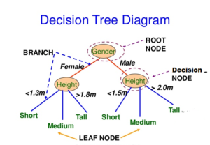
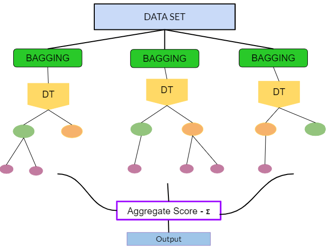
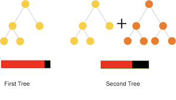

# Árboles de decisión

Los árboles de decisión, también conocidos como modelos de árbol de clasificación y regresión (CART), son métodos basados en árboles para el aprendizaje automático supervisado. Los árboles de clasificación y de regresión simples son fáciles de usar e interpretar, pero no son competitivos con los mejores métodos de aprendizaje automático. Sin embargo, forman la base para el conjunto de modelos de ensamblaje como "bagged trees", "random forest" y "boosted trees", que aunque son menos interpretables, son muy precisos.

Los modelos CART se puede definir en dos tipos de problemas

- **Árboles de clasificación:** la variable resultado es categórica y el métodos se utiliza para identificar la "clase" dentro de la cual es más probable que caiga nuestra variable resultado. Un ejemplo de un problema de tipo clasificación sería determinar quién se suscribirá o no a una plataforma digital; o quién se graduará o no de la escuela secundaria; o si una persona tiene cáncer o no.

- **Árboles de regressión:**  la variable resultado es continua y el métodos se utiliza para predecir su valor. Un ejemplo de un problema de tipo regresión sería predecir los precios de venta de una casa residencial o el nivel de colesterol de una persona. 


Los modelos CART segmentan el espacio predictor en $K$ nodos terminales no superpuestos (hojas). Cada nodo se describe mediante un conjunto de reglas que se pueden utilizar para predecir nuevas respuestas. El valor predicho $\hat{y}$ para cada nodo es la moda (clasificación) o la media (regresión).

Los modelos CART definen los nodos a través de un proceso *top-down greedy* llamado división binaria recursiva (*recursive binary splitting*). El proceso es de arriba hacia abajo porque comienza en la parte superior del árbol con todas las observaciones en una sola región y divide sucesivamente el espacio de predicción. Es *greedy* porque en cada paso de división, la mejor división se realiza en ese paso en particular sin tener en cuenta las divisiones posteriores. La siguiente figura muestra la idea general de esta metodología:

{width=70%}

Como vemos en el ejemplo una de las **ventajas** de los modelos CART es que consideran interacciones. En este curso no vamos a ver la **regresión lógica** pero es una metodología muy interesante que extiende CART cuando las variables predictoras son binarias y las interacciones que buscamos son del tipo AND y OR. Esta metodología se ha empleado con éxito para analizar [datos genéticos](https://academic.oup.com/biostatistics/article/9/1/187/254635) donde el interés radica en saber cuál es el riesgo de desarrolar una enfermeda si te tiene por ejemplo: "una mutación en un punto A del genoma (SNP) y otra mutación en el punto B ó si se tiene una mutación en el punto C pero no se tiene en el punto D.  

También son interesantes porque permiten valores faltantes sin la necesidad de hacer imputaciones previas. 


La mejor división es la variable predictora y el punto de corte que minimiza una función de costo. La función de costo más común para los árboles de regresión es la suma de los residuos al cuadrado,

$$RSS = \sum_{k=1}^K\sum_{i \in A_k}{\left(y_i - \hat{y}_{A_k} \right)^2}.$$
Para árboles de clasificación, es el índice de Gini,

$$G = \sum_{c=1}^C{\hat{p}_{kc}(1 - \hat{p}_{kc})},$$

y la entropía (aka información estadística)

$$D = - \sum_{c=1}^C{\hat{p}_{kc} \log \hat{p}_{kc}}$$

dónde $\hat{p}_{kc}$ es la proporción de observaciones de entrenamiento en el nodo $k$ que son de clase $c$. Un nodo completamente puro en un árbol binario tendría $\hat{p} \in \{ 0, 1 \}$ y $G=D=0$. Un nodo completamente impuro en un árbol binario tendría $\hat{p}=0.5$ y $G=0.5^2 \cdot 2 = 0.25$ y $D = -(0.5 \log(0.5)) \cdot 2 = 0.69$. 


CART repite el proceso de división para cada nodo hijo hasta que se satisface un criterio de detención, generalmente cuando ningún tamaño de nodo supera un máximo predefinido o la división no mejora el modelo de manera significativa. CART también puede imponer un número mínimo de observaciones en cada nodo.

Es probable que el árbol resultante esté sobre-entrenado (*over-fitting*) y, por lo tanto, no se generalice bien para los datos de prueba. Para evitar este problema CART **poda el árbol**, minimizando el error de predicción de validación cruzada. En este caso, el hiperparámetro que debermos seleccionar en este modelo es la profundidad del arbol (e.g. número de nodos). 

En lugar de realizar una validación cruzada de todos los subárboles posibles para encontrar el que tenga el mínimo de error, CART utiliza la poda de complejidad de costos (*cost-complexity pruning*). Costo-complejidad es la compensación entre error (costo) y tamaño del árbol (complejidad) donde la compensación se cuantifica con el parámetro costo-complejidad $c_p$. El costo-complejidad del árbol, $R_{c_p}(T)$, es la suma de su riesgo (error) más un factor de "complejidad de costos" $c_p$ multiplicado pro el tamaño del arbol $|T|$. 

$$R_{c_p}(T) = R(T) + c_p|T|$$

$c_p$  puede tomar cualquier valor de $[0..\infty]$, pero resulta que hay un árbol óptimo para rangos de $c_p$, por lo que solo hay un conjunto finito de valores interesantes para $c_p$ (ver [Therneau y Atkinson 2019](https://cran.r-project.org/web/packages/rpart/vignettes/longintro.pdf). CART utiliza validación cruzada para determinar qué $c_p$ es óptimo.


## Árboles de clasificación

Veamos cómo crear árboles de clasificación usando el conjunto de datos `ISLR::OJ` que se usaron para predecir qué marca de zumo de naranja, Citrus Hill (CH) o Minute Maid = (MM) toman los clientes (variable `Purchase) a partir de 17 variables predictoras.

Vamos a introducir la librería `skimr` que es interesante para hacer descriptivas. Con ella podremos saber, por ejemplo, cuántos tipos de variables tenemos o ver qué distribuciones tienen las variables continuas


```{r}
library(tidyverse)
library(caret)
library(rpart)  # classification and regression trees 
library(rpart.plot)  # better formatted plots than the ones in rpart

oj_dat <- ISLR::OJ
skimr::skim(oj_dat)
```


Dividiremos nuestra base de datos `oj_dat` (n = 1070) en `oj_train` (80%, n = 857) para estimar varios modelos, y `oj_test` (20%, n = 213) para comparar su rendimiento con datos nuevos.

```{r}
set.seed(12345)
partition <- createDataPartition(y = oj_dat$Purchase, p = 0.8, list = FALSE)
oj_train <- oj_dat[partition, ]
oj_test <- oj_dat[-partition, ]
```


La función `rpart::rpart()` construye un árbol completo, minimizando el índice de Gini $G$ por defecto (`parms = list (split = "gini")`), hasta que se cumpla el criterio de parada. El criterio de parada predeterminado es:

- solo intenta una división si el nodo actual tiene al menos `minsplit = 20` observaciones, y
- solo acepta una división si
     + los nodos resultantes tienen al menos `minbucket = round (minsplit / 3)` observaciones, y
     + el ajuste general resultante mejora en `cp = 0.01` (es decir, $\Delta G <= 0.01$).

```{r}
# Usar method = "class" para clasificación y method = "anova" para regresión
set.seed(123)
oj_mdl_cart_full <- rpart(formula = Purchase ~ ., data = oj_train, 
                          method = "class")
oj_mdl_cart_full
```


La salida comienza con el nodo raíz. La clase predicha en la raíz es `CH` y esta predicción produce 334 errores en las 857 observaciones para una tasa de éxito (precisión) del 61% y una tasa de error del 39%. Los nodos secundarios del nodo “x” están etiquetados como 2x) y 2x + 1), por lo que los nodos secundarios de 1) son 2) y 3), y los nodos secundarios de 2) son 4) y 5). Los nodos terminales están etiquetados con un asterisco (*).

Sorprendentemente, solo 3 de las 17 variables se utilizaron en el árbol completo: LoyalCH (lealtad de marca del cliente para CH), PriceDiff (precio relativo de MM sobre CH) y SalePriceMM (precio absoluto de MM). La primera división está en LoyalCH = 0.48285. Aquí hay un diagrama del árbol completo (sin podar).

```{r}
rpart.plot(oj_mdl_cart_full, yesno = TRUE)
```


Las cajas muestran la clasificación del nodo (según la moda), la proporción de observaciones que no son `CH` y la proporción de observaciones incluidas en el nodo.

`rpart ()` no solo hizo crecer el árbol completo, sino que identificó el conjunto de parámetros de complejidad de costos y midió el rendimiento del modelo de cada árbol correspondiente mediante validación cruzada. `printcp ()` muestra los posibles valores de $c_p$. La siguiente tabla se puede utilizar esta tabla para decidir cómo podar el árbol.

```{r}
printcp(oj_mdl_cart_full)
```

Hay 4 valores de $c_p$ en este modelo. El modelo con el parámetro de complejidad más pequeño permite la mayoría de las divisiones (`nsplit`). El parámetro de mayor complejidad corresponde a un árbol con solo un nodo raíz. `rel error` es la tasa de error relativa al nodo raíz. El error absoluto del nodo raíz es 0.38973162 (la proporción de MM), por lo que su `rel error` es 0.38973162 / 0.38973162 = 1.0. Eso significa que el error absoluto del árbol completo (en CP = 0.01) es 0.42814 * 0.38973162 = 0.1669. Podemos verificarlo calculando la tasa de error de los valores predichos:


```{r}
pred <- predict(oj_mdl_cart_full, newdata = oj_train, type = "class")
mean(oj_train$Purchase != pred)
```

Para acaber de explicar toda la salida de la table CP, `xerror` es la tasa de error relativa con validación cruzada y `xstd` es su error estándar. Si se desea el error más bajo posible, deberíamos podar el árbol con el error de CV relativo más pequeño, $c_p=0.01$. Si deseamos equilibrar el poder predictivo con la simplicidad, podaremos al árbol más pequeño dentro de 1 SE del que tiene el error relativo más pequeño. La tabla CP no es muy útil para encontrar ese árbol, así que añadiremos una columna para encontrarlo.

```{r}
oj_mdl_cart_full$cptable %>%
   data.frame() %>%
   mutate(
      min_idx = which.min(oj_mdl_cart_full$cptable[, "xerror"]),
      rownum = row_number(),
      xerror_cap = oj_mdl_cart_full$cptable[min_idx, "xerror"] + 
                   oj_mdl_cart_full$cptable[min_idx, "xstd"],
      eval = case_when(rownum == min_idx ~ "min xerror",
                       xerror < xerror_cap ~ "under cap",
                       TRUE ~ "")
   ) %>%
   dplyr::select(-rownum, -min_idx) 
```

El árbol más simple que usa la regla 1-SE es $c_p = 0.01347305$ (error CV = 0.18). Afortunadamente, `plotcp ()` nos da una representación gráfica de la relación entre `xerror` y `cp`.

```{r}
plotcp(oj_mdl_cart_full, upper = "splits")
```

La línea discontinua se establece en el mínimo `xerror + xstd`. El eje superior muestra el número de divisiones en el árbol. NOTA: No estoy seguro de por qué los valores de CP no son los mismos que en la tabla (están cerca, pero no son los mismos). La figura sugiere que debería podar a 5 o 3 divisiones. Vemos que esta curva nunca llega al mínimo, sigue disminuyendo en 5 divisiones. El valor del parámetro de ajuste predeterminado `cp = 0.01` puede ser demasiado grande, así que lo cambiaremos a `cp = 0.001` y empezaremos de nuevo.

```{r}
set.seed(123)
oj_mdl_cart_full <- rpart(
   formula = Purchase ~ .,
   data = oj_train,
   method = "class",
   cp = 0.001
   )
print(oj_mdl_cart_full)
```


Este es un árbol mucho más grande. ¿Encontramo un valor `cp` que produce un mínimo?

```{r}
plotcp(oj_mdl_cart_full, upper = "splits")
```


Sí, el mínimo está en CP = 0.011 con 5 divisiones. El mínimo + 1 SE está en CP = 0.021 con 3 divisiones. Podaremos entonces el árbol en 3.

```{r}
oj_mdl_cart <- prune(
   oj_mdl_cart_full,
   cp = oj_mdl_cart_full$cptable[oj_mdl_cart_full$cptable[, 2] == 3, "CP"]
)
rpart.plot(oj_mdl_cart, yesno = TRUE)
```

El indicador de compra más "importante" parece ser `LoyalCH`. De la [vignette de rpart](https://cran.r-project.org/web/packages/rpart/vignettes/longintro.pdf) (página 12) tenemos que:

```
An overall measure of variable importance is the sum of the goodness of split measures for each split for which it was the primary variable, plus goodness (adjusted agreement) for all splits in which it was a surrogate.
```

"Surrogate" (variable subrogada[^La FDA define una variable subrogada como “una medida de laboratorio o signo físico que se usa en ensayos terapéuticos como sustituto de una variable clínicamente significativa que es una medida directa sobre lo que siente un paciente, sus funciones o su supervivencia y que se espera que prediga el efecto de la terapia]) se refieren a características alternativas para que un nodo maneje los datos faltantes. Para cada división, CART evalúa una variedad de divisiones alternativas "sustitutas" para usar cuando el valor de la característica para la división principal es NA. Las divisiones sustitutas son divisiones que producen resultados similares a la división original.

La importancia de una variable es la suma de la mejora en la medida general de Gini (o RMSE) producida por los nodos en los que aparece. En el siguiente gráfico podemos ver la importancia de cada variable para este modelo.

```{r}
oj_mdl_cart$variable.importance %>% 
   data.frame() %>%
   rownames_to_column(var = "Feature") %>%
   rename(Overall = '.') %>%
   ggplot(aes(x = fct_reorder(Feature, Overall), y = Overall)) +
   geom_pointrange(aes(ymin = 0, ymax = Overall), color = "cadetblue", size = .3) +
   theme_minimal() +
   coord_flip() +
   labs(x = "", y = "", title = "Importancia mediante clasificación simple")
```

`LoyalCH` es, con mucho, la variable más importante, como se esperaba de su posición en la parte superior del árbol así como en el siguiente nivel abajo.

Podemos ver cómo aparecen los variables subrogadas en el modelo con la función `summary()`.

```{r}
summary(oj_mdl_cart)
```

Una vez tenemos un modelo (o varios) los podemos evaluar en la muestra test con las medidas estándard

```{r}
pred <- predict(oj_mdl_cart, newdata = oj_test, type = "class") 
oj_cm_cart <- confusionMatrix(pred,  oj_test$Purchase)
oj_cm_cart
```

También podemos representar gráficamente la tabla de confusión

```{r}
plot(oj_test$Purchase, pred, 
     main = "Clasificación: Predicho vs. Observado",
     xlab = "Observado",
     ylab = "Predicho")
```

## Área bajo la curva ROC
También podemos calcular el área bajo la curva ROC. La curva ROC (características operativas del receptor) es otra medida de precisión. Corresponde a un gráfico de la tasa de verdaderos positivos (TPR, sensibilidad) versus la tasa de falsos positivos (FPR, 1 - especificidad) para un conjunto de umbrales. De forma predeterminada, el umbral para predecir la clasificación predeterminada es 0.50, pero podría ser cualquier umbral. La función `precrec::evalmod ()` calcula los valores de la matriz de confusión del modelo usando el conjunto de datos test. El AUC en el conjunto de datos test es 0.8848 y podemos calcularlo con varias funciones: `pROC::plot.roc ()`, `plotROC::geom_roc ()`,  `yardstick::roc_curve ()` y `plotROC` para usar `ggplot()` [geometría `geom_roc ()`]. 

Nosotros usaremos `pROC`. Para ello necesitamos tener las predicciones como probabilidades para la categoría de referencia.  **NOTA:** El AUC es, pues, una medida útil para casos donde el predictor es binario.


```{r}
library(pROC)
pred2 <-  predict(oj_mdl_cart, newdata = oj_test, type = "prob")[,"CH"]
roc.car <- roc(oj_test$Purchase, pred2, print.auc=TRUE, 
               ci=TRUE,
               plot=TRUE)
```

### Entrenamiento con `caret`

También podemos ajustar el modelo con la función `caret::train ()`. Recordemo que hay dos formas de ajustar los hiperparámetros cuando usamos `train ()`:

- establecer el número de valores de parámetros de ajuste a considerar utilizando `tuneLength`, o
- establecer ciertos valores para cada parámetro utilizando `tuneGrid`.

**ESTRATEGIA:** Construiremos el modelo usando una validación cruzada de 10 veces para optimizar el hiperparámetro CP. Si no tenemos idea de cuál es el parámetro de ajuste óptimo, empezaremos con `tuneLength` para aproximarnos al valor óptimo y luego ajustaremos el valor  con `tuneGrid`. Crearemos un objeto de control de entrenamiento que puedo reutilizar en otras compilaciones de modelos.

```{r}
oj_trControl = trainControl (method = "cv",
   number = 10,
   savePredictions = "final",  # guardaremos preds para el valor óptimo del parámetro a tunear
   classProbs = TRUE,  # probs para las clases además de preds
   summaryFunction = twoClassSummary
   )
```

Ahora estimamos el modelo con

```{r}
set.seed(1234)
oj_mdl_cart2 <- train(
   Purchase ~ ., 
   data = oj_train, 
   method = "rpart",
   tuneLength = 5,
   metric = "ROC",
   trControl = oj_trControl
   )
```

`caret` construye un árbol completo usando los parámetros predeterminados de `rpart` que son: índice de división de Gini, al menos 20 observaciones en un nodo para considerar dividirlo, y al menos 6 observaciones en cada nodo. Luego, `caret` calcula la precisión para cada valor candidato del hiperparámetro (CP). Estos son los resultados:

```{r}
oj_mdl_cart2
```

El segundo CP (0.008982036) produce la mayor precisión. Podemos profundizar en el mejor valor de CP usando un *tuning grid*.

```{r}
set.seed(1234)
oj_mdl_cart2 <- train(
   Purchase ~ ., 
   data = oj_train, 
   method = "rpart",
   tuneGrid = expand.grid(cp = seq(from = 0.001, to = 0.010, length = 11)),  
   metric = "ROC",
   trControl = oj_trControl
   )
print(oj_mdl_cart2)
```


El mejor modelo se consigue con CP = 0.0082. A continuación podemos ver  las precisiones de validación cruzada para los valores de CP candidatos.

```{r}
plot(oj_mdl_cart2)
```

Estos son los resultados para el modelo final:

```{r}
oj_mdl_cart2$finalModel
```

```{r}
rpart.plot(oj_mdl_cart2$finalModel)
```

Veamos el rendimiento en la muestra test:

```{r}
pred3 <- predict(oj_mdl_cart2, newdata = oj_test, type = "raw") 
oj_cm_cart2 <- confusionMatrix(pred3,  oj_test$Purchase)
oj_cm_cart2
```

La precisión es 0.8545, un poco peor que la 0.8592 del método directo. El AUC es 0.916 que es mejor que el obtenido con el método directo.

```{r}
pred4 <- predict(oj_mdl_cart2, newdata = oj_test, type = "prob")[,"CH"] 
roc.car2 <- roc(oj_test$Purchase, pred4, print.auc=TRUE, 
               ci=TRUE,
               plot=TRUE)
```

Podemos comparar ambas curvas ROC mediante el [test de DeLong](https://www.jstor.org/stable/pdf/2531595.pdf?seq=1)

```{r}
roc.test(roc.car, roc.car2)
```

Finalmente, podemos crear fácilmente la gráfica de importancia de variables con la función `varImp ()`. La lealtad a la marca es lo más importante, seguida de la diferencia de precio.

```{r}
plot(varImp(oj_mdl_cart2), main="Importancia de variables con CART (caret)")
``` 

Parece que con la estrategia de `caret` hemos conseguido un mejor modelo predictivo gracias, sobre todo, a la posibilidad de buscar el mejor hiperparámetro haciend *fine tuning*. 

```{r}
oj_scoreboard <- rbind(
   data.frame(Modelo = "Single Tree", 
              Accuracy = oj_cm_cart$overall["Accuracy"],
              ROC = roc.car$auc),
   data.frame(Modelo = "Single Tree (caret)", 
              Accuracy = oj_cm_cart2$overall["Accuracy"],
              ROC = roc.car2$auc)) %>% 
   arrange(desc(ROC))
knitr::kable(oj_scoreboard, row.names = FALSE)
```

## Árboles de regresión

Un árbol de regresión simple se construye de manera similar a un árbol de clasificación simple y, al igual que el árbol de clasificación, rara vez se usan por sí solo (sobre todo en problemas complejos o de big data). De nuevo, basaremos el aprendizaje de esta metodología partiendo de un ejemplo real. Usaremos el conjunto de datos `ISLR::Carseats` que pretende predecir las ventas de sillitas de niños para coches  (variable `Sales`) en 400 tiendas usando 10 variables que contienen información de las  características de las sillas.


```{r}
cs_dat <- ISLR::Carseats
skimr::skim(cs_dat)
```

De nuevo, partiremos nuestro conjunto de datos `cs_dat` (n = 400) en `cs_train` (80%, n = 321) y `cs_test` (20%, n = 79).

```{r}
set.seed(12345)
partition <- createDataPartition(y = cs_dat$Sales, p = 0.8, list = FALSE)
cs_train <- cs_dat[partition, ]
cs_test <- cs_dat[-partition, ]
```


El primer paso es construir un árbol completo y luego realizar una validación cruzada  para ayudar a seleccionar la complejidad de costo óptima (cp). La única diferencia ahora es que usaremos `method = "anova"` en la función `rpart ()` para poder estimar un árbol de regresión.

```{r}
set.seed(1234)
cs_mdl_cart_full <- rpart(Sales ~ ., cs_train, method = "anova")
cs_mdl_cart_full
``` 


Las ventas pronosticadas en la raíz son las ventas medias para el conjunto de datos de entrenamiento, 7.5 (los valores corresponden a miles de dolares).  La primera división está en `ShelveLoc = [Bad, Medium]` vs `Good` (calidad). Aquí está el diagrama de árbol sin podar.

```{r}
rpart.plot(cs_mdl_cart_full, yesno = TRUE)
```

Cada caja muestra el valor predicho del nodo (media) y la proporción de observaciones que están en el nodo (o nodos secundarios).

`rpart ()` estima el árbol completo y utiliza validación cruzada para probar el rendimiento de los posibles hiperparámetros de complejidad. Como antes, `printcp ()` muestra los valores de cp candidatos que pueden verse en esta tabla. Estos datos pueden ser utilizados para decidir cómo podar el árbol.

```{r}
printcp(cs_mdl_cart_full)
```


Hay 16 posibles valores de cp en este modelo. El modelo con el parámetro de complejidad más pequeño permite la mayoría de las divisiones (nsplit). El parámetro de mayor complejidad corresponde a un árbol con solo un nodo raíz. `rel error` es el SSE relativo al nodo raíz. El SSE del nodo raíz es 2567.76800, por lo que su error rel es 2567.76800 / 2567.76800 = 1.0. Eso significa que el error absoluto del árbol completo (en CP = 0.01) es 0.30963 * 2567.76800 = 795.058. Podemos verificar estos resultados  calculando el SSE de los valores predichos del modelo:

```{r}
data.frame(pred = predict(cs_mdl_cart_full, newdata = cs_train)) %>%
   mutate(obs = cs_train$Sales,
          sq_err = (obs - pred)^2) %>%
   summarise(sse = sum(sq_err))
```


La tabla también muestra, `xerror` que corresponde al SSE con validación cruzada y `xstd` a su error estándar. Si deseamos el error más bajo posible, podaremos el árbol con el SSE relativo más pequeño (`xerror`). Si deseamos equilibrar el poder predictivo con la simplicidad, podaremos al árbol más pequeño que esté dentro de 1 SE para el SSE relativo más pequeño. Al igual que en la sección anterior, la tabla CP no es muy útil para encontrar ese árbol, por lo que debemos añadir una columna para visualizar dicha información:

```{r}
cs_mdl_cart_full$cptable %>%
   data.frame() %>%
   mutate(min_xerror_idx = which.min(cs_mdl_cart_full$cptable[, "xerror"]),
          rownum = row_number(),
          xerror_cap = cs_mdl_cart_full$cptable[min_xerror_idx, "xerror"] + 
             cs_mdl_cart_full$cptable[min_xerror_idx, "xstd"],
          eval = case_when(rownum == min_xerror_idx ~ "min xerror",
                           xerror < xerror_cap ~ "under cap",
                           TRUE ~ "")) %>%
   dplyr::select(-rownum, -min_xerror_idx) 
```


Bien, entonces el árbol más simple es el que tiene CP = 0.02599265 (5 divisiones). También podemos usar `plotcp () para visualizar la relación entre `xerror` y `cp`.

```{r}
plotcp(cs_mdl_cart_full, upper = "splits")
```


La línea discontinua se establece en el mínimo `xerror + xstd`. El eje superior muestra el número de divisiones en el árbol. El error relativo más pequeño está en CP = 0.01 (15 divisiones), pero el CP máximo debajo de la línea discontinua (una desviación estándar por encima del error mínimo) está en CP = 0.02599265 (5 divisiones). Utilizamos entonces la función `prune ()` para podar el árbol especificando el coste-complejidad asociado a este CP.

```{r}
cs_mdl_cart <- prune(
   cs_mdl_cart_full,
   cp = cs_mdl_cart_full$cptable[cs_mdl_cart_full$cptable[, 2] == 5, "CP"]
)
rpart.plot(cs_mdl_cart, yesno = TRUE)
```

El indicador más "importante" de ventas es `ShelveLoc`. Estos son los valores de importancia del modelo:

```{r}
cs_mdl_cart$variable.importance %>% 
   data.frame() %>%
   rownames_to_column(var = "Feature") %>%
   rename(Overall = '.') %>%
   ggplot(aes(x = fct_reorder(Feature, Overall), y = Overall)) +
   geom_pointrange(aes(ymin = 0, ymax = Overall), color = "cadetblue", size = .3) +
   theme_minimal() +
   coord_flip() +
   labs(x = "", y = "", title = "Variable Importance with Simple Regression")
```


El indicador más importante de ventas es `ShelveLoc`, luego `Price`, luego `Age` (edad media de la población donde está la tienda). Todas estas variables aparecen en el modelo final. `CompPrice` (precio del competidor) también es relevante.


El último paso es hacer predicciones sobre el conjunto de datos de validación. Cuando la variable respuesta es continua usamos:

- la raíz del error cuadrático medio $RMSE = \sqrt{(1/2) \sum{(actual - pred)^2}})$ y

- el errr absoluto medio $MAE = (1/n) \sum{|actual - pred|}$

La diferencia entre ambos es que RMSE penaliza más los errores grandes. Para un árbol de regresión, basta con indicar `type="vector")  en la función `predict ()` (que es el valor por defecto).


```{r}
cs_preds_cart <- predict(cs_mdl_cart, cs_test, type = "vector")

cs_rmse_cart <- RMSE(
   pred = cs_preds_cart,
   obs = cs_test$Sales
)
cs_rmse_cart
```


El proceso de poda conduce a un error de predicción promedio de 2.363 en el conjunto de datos de prueba. No está mal considerando que la desviación estándar de la variable `Sales` es 2.8. Podemos visualizar la relación entre los datos predichos y los observados mediante:

```{r}
data.frame(Predichos = cs_preds_cart, Observados = cs_test$Sales) %>%
   ggplot(aes(x = Observados, y = Predichos)) +
   geom_point(alpha = 0.6, color = "cadetblue") +
   geom_smooth() +
   geom_abline(intercept = 0, slope = 1, linetype = 2) +
   labs(title = "Carseats CART, predichos vs observados")
```

### Entrenamiento con `caret` 

También podemos ajustar el modelo con `caret::train ()` especificando `method = "rpart"`. Construirmos el modelo usando 10-fold CV para optimizar el hiperparámetro CP.

```{r}
cs_trControl = trainControl(
   method = "cv",
   number = 10,
   savePredictions = "final" 
)
```

Usaremos la misma estrategia que en el caso de los árboles de clasificación, 
dejaremos que el modelo busque el mejor parámetro de ajuste de CP con `tuneLength` y luego lo ajustaremos con `tuneGrid`.

```{r}
set.seed(1234)
cs_mdl_cart2 = train(
   Sales ~ ., 
   data = cs_train, 
   method = "rpart",
   tuneLength = 5,
   metric = "RMSE",
   trControl = cs_trControl
)
```

```{r}
cs_mdl_cart2
```


El primer cp (0.04167149) presenta el RMSE más pequeño. Puedemos hacer una búsqueda más fina para mejorar el valor de cp usando un *grid*:

```{r}
set.seed(1234)
cs_mdl_cart2 = train(
   Sales ~ ., 
   data = cs_train, 
   method = "rpart",
   tuneGrid = expand.grid(cp = seq(from = 0, to = 0.1, by = 0.01)),
   metric = "RMSE",
   trControl = cs_trControl
)
cs_mdl_cart2
```

En este ejemplo, parece que el árbol con mejor rendimiento es el que no ha sido podado.

```{r}
plot(cs_mdl_cart2)
```

Este sería el modelo final

```{r}
rpart.plot(cs_mdl_cart2$finalModel)
```

y estas las variables más importantes

```{r}
plot(varImp(cs_mdl_cart2), main="Importancia de variables para Regresión")
```

Como siempre, debemos evaluar el modelo en nuestra muestra test:

```{r}
cs_preds_cart2 <- predict(cs_mdl_cart2, cs_test, type = "raw")
data.frame(Actual = cs_test$Sales, Predicted = cs_preds_cart2) %>%
ggplot(aes(x = Actual, y = Predicted)) +
   geom_point(alpha = 0.6, color = "cadetblue") +
   geom_smooth(method = "loess", formula = "y ~ x") +
   geom_abline(intercept = 0, slope = 1, linetype = 2) +
   labs(title = "Carseats CART, Predicted vs Actual (caret)")
```

Observamos como el modelo sobreestima en el extremo inferior y subestima en el extremo superior. Podemos calcular el RMSE para estos datos:

```{r}
(cs_rmse_cart2 <- RMSE(pred = cs_preds_cart2, obs = cs_test$Sales))
```

Caret mejora las predicciones: 

```{r}
cs_scoreboard <- rbind(
   data.frame(Modelo = "Single Tree", RMSE = cs_rmse_cart),
   data.frame(Modelo = "Single Tree (caret)", RMSE = cs_rmse_cart2)
) %>% arrange(RMSE)
knitr::kable(cs_scoreboard, row.names = FALSE)
```


## Bagged trees

Los CART tiene una capacidad predictiva moderada, es por ello que se han propuesto unos métodos que combinan varios árboles de decisión para producir un mejor rendimiento predictivo que utilizar un solo árbol de decisión. El principio fundamental detrás de estos modelos es que un grupo de predictores débiles puede conseguir un predictor con mejor capacidad predictiva. 

Tenemos dos tipos de estrategias:

- *Bagging*
- *Boosting*

> Bagging (Bootstrap Aggregation) se utiliza cuando nuestro objetivo es reducir la varianza de un árbol de decisión. La idea es crear varios subconjuntos de datos a partir de la muestra de entrenamiento elegida al azar con reemplazamiento. Cada subconjunto de datos se utiliza para entrenar un árbol de decisión. Como resultado, terminamos con un conjunto de diferentes modelos. Se utiliza el promedio de todas las predicciones de diferentes árboles, que es más robusto que considerar un solo árbol de decisión.





> En el Boosting se aprende de forma secuencial. Ajustamos árboles  consecutivos (muestra aleatoria) y en cada paso, el objetivo es mejorar el error del árbol anterior.


{width=70%}


Como hemos dicho anteriormente, el algoritmo *bagged* construye B árboles decisión usando conjuntos de entrenamiento obtenidos mediante remuestreo y promedia las predicciones resultantes. Estos árboles crecen profundamente y no se podan. Por tanto, cada árbol individual tiene una alta varianza, pero un bajo sesgo. Promediar los B árboles ayuda a reducir la varianza. El valor predicho para una observación es la moda (clasificación) o la media (regresión) de los árboles. B generalmente es igual a ~ 25.


 Para un conjunto de entrenamiento de tamaño $n$, cada árbol se compone de $\sim (1 - e^{-1})n = .632n$ observaciones únicas *in-bag* y $.368n$ *out-of-bag*. Las observaciones que no han sido seleccionadas en el re-muestreo se usan para evaluar la precisión del modelo. La capacidad glogal del método se obtiene promediando la capacidad de cada árbol. Esto tiene una **desventaja obvia** y es que si cada árbol tiene un rendimiento deficiente, el rendimiento promedio de muchos árboles seguirá siendo deficiente. Además, otra desventaja de este método es que no existe un árbol único con un conjunto de reglas para interpretar. En consecuencia, no queda claro qué variables son más importantes que otras y en algunos problemas (sobre todo biomédicos) esto puede ser una limitación importante.


### Bagging árboles de clasificación
 
Veamos de nuevo con un ejemplo cómo trabajar con estos métodos. Usaremos de nuevo los datos de zumos de naranja `OJ`. Esta vez usaremos un método *bagging* especificando `method="treebag"`. Caret no tiene hiperparámetros para este modelo, por lo que no es necesario usar `tuneLegth` ni `tuneGrid`. El tamaño de conjunto predeterminado es `nbagg = 25` (a veces se puede tunear, pero en este caso lo dejaremos fijo). 

```{r}
set.seed(1234)
oj_mdl_bag <- train(
   Purchase ~ ., 
   data = oj_train, 
   method = "treebag",
   trControl = oj_trControl,
   metric = "ROC"
)
oj_mdl_bag$finalModel
```


Veamos el rendimiento en el conjunto de datos test.
 
```{r}
pred_bag <- predict(oj_mdl_bag, newdata = oj_test, type = "raw")
oj_cm_bag <- confusionMatrix(pred_bag, oj_test$Purchase)
oj_cm_bag
```
 

La precisión es 0.8451, sorprendentemente peor que el 0.85915 del modelo de árbol único, pero esa es una diferencia que corresponde a tres predicciones en un conjunto de 213. Esta sería la curva ROC.

```{r}
pred_bag2 <- predict(oj_mdl_bag, newdata = oj_test, type = "prob")[,"CH"]
roc.bag <- roc(oj_test$Purchase, pred_bag2, print.auc=TRUE, 
               ci=TRUE,
               plot=TRUE)
```

Veamos cuáles son las variables más importantes

```{r}
plot(varImp(oj_mdl_bag), main="Importancia de variables con Bagging")
```

Esta es la comparación entre métodos


```{r}
oj_scoreboard <- rbind(oj_scoreboard,
   data.frame(Modelo = "Bagging", 
              Accuracy = oj_cm_bag$overall["Accuracy"],
              ROC = roc.bag$auc)
) %>% arrange(desc(ROC))
knitr::kable(oj_scoreboard, row.names = FALSE)
```

### Bagging árboles de regresión

Usemos *bagging* para predecir las ventas en los datos `Carseats`: 


```{r}
set.seed(1234)
cs_mdl_bag <- train(
   Sales ~ ., 
   data = cs_train, 
   method = "treebag",
   trControl = cs_trControl
)
cs_mdl_bag
```

Veamos el rendimiento en el conjunto de datos test. El RMSE es 1.9185, pero el modelo predice en exceso en el extremo inferior de ventas y tampoco predice bien en el extremo superior (como un árbol simple).


```{r}
cs_preds_bag <- bind_cols(
   Predicted = predict(cs_mdl_bag, newdata = cs_test),
   Actual = cs_test$Sales
)
(cs_rmse_bag <- RMSE(pred = cs_preds_bag$Predicted, obs = cs_preds_bag$Actual))
```

```{r}
cs_preds_bag %>%
   ggplot(aes(x = Actual, y = Predicted)) +
   geom_point(alpha = 0.6, color = "cadetblue") +
   geom_smooth(method = "loess", formula = "y ~ x") +
   geom_abline(intercept = 0, slope = 1, linetype = 2) +
   labs(title = "Carseats Bagging, Predicted vs Actual (caret)")
```

La importancia de las variables son:

```{r}
plot(varImp(cs_mdl_bag), main="Importancia de variables con Bagging")
```

Y la comparación quedaría

```{r}
cs_scoreboard <- rbind(cs_scoreboard,
   data.frame(Modelo = "Bagging", RMSE = cs_rmse_bag)
) %>% arrange(RMSE)
knitr::kable(cs_scoreboard, row.names = FALSE)
```


-------------------------------------------------------------------
**EJERCICIO** (Entrega en Moodle: P2-Bagged):

Implementa una función que implemente el método "bagged tree". Aplícalo a los datos "Carseats" y compara tus resultados con los que se obtienen usando caret.
-------------------------------------------------------------------


-------------------------------------------------------------------
**EJERCICIO** (Entrega en Moodle: P-Bagged Breast cancer):

Utiliza los datos de cáncer de mama que hemos trabajado en clase "breast_train_prep" y "breast_test_prep" (que puedes encontrar en el fichero "breast.Rdata" del Moodle) para crear un modelo predictivo usando CART y Bagged Trees. Compara los resultados con los obtenidos mediant KNN y LDA reportados en el bookdown del curso.
-------------------------------------------------------------------

## Random Forest

Los *Random Forest* (bosques aleatorios) también son un conjunto de árboles de decisión (*ensambladores*) que mejoran los *bagged trees* mediante la creación de un bosque no correlacionados de árboles que, de nuevo, mejora la capacidad predictiva de un único árbol. Al igual que en el *bagged* (*embolsado*), el algoritmo construye varios árboles de decisión sobre muestras de entrenamiento bootstrap. Sin embargo, al construir estos árboles de decisión, cada vez que se considera una división en un árbol, se elige una muestra aleatoria de predictores (hiperparámetro *m* o *mtry*) como candidatos de división del conjunto completo de predictores $p$. En cada división se toma una nueva muestra de predictores. Típicamente $m \approx \sqrt{p}$. En consecuencia, los árboles *bagged* son un caso especial de los *random forest* cuando $m = p$. 

Cada árbol del modelo *random forest* se construye de la siguiente forma:

- Si denotamos por $N$ el número de casos en el conjunto de entrenamiento, seleccionaremos una muestra de esos $N$ casos se forma aleatoria CON REEMPLAZAMIENTO. Esta muestra será el conjunto de entrenamiento para construir el árbol i-ésimo.

- Si denotamos por $M$ el número total de varibles predictoras, seleccionaremos un número $m < M$ de variables y crearemos un árbol completo con esas variables. El valor $m$ se mantiene constante durante la generación de todo el bosque.

- Cada árbol crece hasta su máxima extensión posible y NO hay proceso de poda.

- La predicción para nuevos individuos se hace a partir de la información obtenida de las predicciones de los $B$ árboles (mayoría de votos para clasificación, promedio para regresión). La siguiente figura ilustra este proceso


Podemos estimar un *random forest* con `cart` indicando el argumento `method = "rf"`. El hiperparámetro `mtry` ($m$) puede tomar cualquier valor de 1 a 17 (el número de predictores) y se espera que el valor óptimo esté cerca de $\sqrt{17} \approx 4$. En cuanto al número de árboles (segundo hiperparámetro), hay estudios que demuestran que el rendimiento empeora cuando tenemos muchos árboles, sin embargo esto no está muy claro y por lo general se recomienda entrenar modelos con muchos árboles. Por defecto `method = "rf"` tiene 500 (argumento `num.trees`).  

```{r}
set.seed(1234)
oj_mdl_rf <- train(
   Purchase ~ ., 
   data = oj_train, 
   method = "rf",
   metric = "ROC",
   tuneGrid = expand.grid(mtry = 3:10),
   trControl = oj_trControl,
   num.trees = 500
)
oj_mdl_rf
```


El valor de ROC más alto se da en $m = 7$ que es más alto de lo que esperábamos, pero fijémosnos que es un valor de ROC muy similar al que se obtiene con $m=4$, por lo que por el principio de parsimonia podríamos usar dicho valor

```{r}
plot(oj_mdl_rf)
```


También podemos visualizar los resultados con:

```{r}
plot_rf <- function(model) {
    theme_set(theme_minimal())
    u <- model$results %>%
        dplyr::select(mtry, ROC, Sens, Spec) %>%
        gather(a, b, -mtry)
    
    u %>% ggplot(aes(mtry, b)) + geom_line() + geom_point() + 
        facet_wrap(~ a, scales = "free") + 
        labs(x = "Número de predictores", y = NULL, 
             title = "Relación entre el número de predictores y el comportamiento del modelo")
}

oj_mdl_rf %>% plot_rf()
```


-------------------------------------------------------------------
**EJERCICIO** (Entrega en Moodle: P2-Plot RF):

Si en el modelo `train` usamos `metric = "prSummary"` también podemos visualizar otras métricas para evaluar el comportamiento del modelo. En particular el AUC que puede ser interesante desde un punto de vista práctico. Crea una función que visualice dichas métricas y aplícalo a los datos `oj_train` (que obviamente tendrás que re-entrenar con esa nueva métrica).
-------------------------------------------------------------------


Podemos usar este modelo para hacer predicciones sobre la muestra test

```{r}
pred_rf <- predict(oj_mdl_rf, newdata = oj_test, type = "raw")
oj_cm_rf <- confusionMatrix(pred_rf, oj_test$Purchase)
oj_cm_rf
```

Y el área bajo la curva ROC sería:

```{r}
pred_rf2 <- predict(oj_mdl_rf, newdata = oj_test, type = "prob")[,"CH"]
roc.rf <- roc(oj_test$Purchase, pred_bag2, print.auc=TRUE, 
               ci=TRUE,
               plot=TRUE)
```

que compara con los modelos anteriores de esta forma:

Y la comparación quedaría

```{r}
oj_scoreboard <- rbind(oj_scoreboard,
   data.frame(Modelo = "Random Forest", 
              Accuracy = oj_cm_rf$overall["Accuracy"],
              ROC = roc.rf$auc)
) %>% arrange(desc(ROC))
knitr::kable(oj_scoreboard, row.names = FALSE)
```

Recordemos que la importancia de las variables se puede ver con la función `varImp` al igual que cualquier otro modelo basado en àrboles de decisión. 

**NOTA:** El ejemplo para Random Forest con árboles de regresión es igual que lo que vimos en la sección anterior. 


**NOTA2:** [En este artículo](https://www.ncbi.nlm.nih.gov/pmc/articles/PMC7508310/) se hace un "benchmarking" muy interesante para saber qué método y libería de R usar en función de las características de nuestro conjunto de datos. 


Speiser JL et al. (2012). **A Comparison of Random Forest Variable Selection Methods for Classification Prediction Modeling**

> Random forest classification is a popular machine learning method for developing prediction models in many research settings. Often in prediction modeling, a goal is to reduce the number of variables needed to obtain a prediction in order to reduce the burden of data collection and improve efficiency. Several variable selection methods exist for the setting of random forest classification; however, there is a paucity of literature to guide users as to which method may be preferable for different types of datasets. Using 311 classification datasets freely available online, we evaluate the prediction error rates, number of variables, computation times and area under the receiver operating curve for many random forest variable selection methods. We compare random forest variable selection methods for different types of datasets (datasets with binary outcomes, datasets with many predictors, and datasets with imbalanced outcomes) and for different types of methods (standard random forest versus conditional random forest methods and test based versus performance based methods). Based on our study, the best variable selection methods for most datasets are Jiang’s method and the method implemented in the VSURF R package. For datasets with many predictors, the methods implemented in the R packages varSelRF and Boruta are preferable due to computational efficiency. A significant contribution of this study is the ability to assess different variable selection techniques in the setting of random forest classification in order to identify preferable methods based on applications in expert and intelligent systems.


-------------------------------------------------------------------
**EJERCICIO** (Entrega en Moodle: P-RF Breast cancer):

Utiliza los datos de cáncer de mama que hemos trabajado en clase "breast_train_prep" y "breast_test_prep" (que puedes encontrar en el fichero "breast.Rdata" del Moodle) para crear un modelo predictivo usando Random Forest. Compara los resultados con los obtenidos mediante KNN y LDA reportados en el bookdown del curso (y di si mejora los que obtuviste con CART y Bagged Trees).
-------------------------------------------------------------------


## Random Forest p>>n

**Problema**: Aplicar Random Forest para conjunto de datos con muchas variables (caso p>>n)

- **Posible estrategia**: 

1. Creamos K subconjuntos de variable
2. Llevamos a cabo una selección de las variables más importantes y nos quedamos con una parte de ellas. Por ejemplo, las M más informativas
3. Combinamos las K*M variables y repetimos los pasos 1 y 2
4. Acabamos con M variables seleccionadas
5. Aplicamos Random Forest

Este enfoque podría causar la pérdida de algunas variables importantes, pero generalmente seleccionará las variables más informativas. 

Selección de K y M
[Breiman (2001)](https://www.stat.berkeley.edu/~breiman/randomforest2001.pdf) recomienda $m=p/3$ en clasificación y $m=\sqrt{p}$ en regresión (mtry). ¿Puede servir esto de ayuda?

- [Reguralized Random Forest](https://cran.r-project.org/web/packages/RRF/RRF.pdf)

- [Guided Regularized Random Forest](thttps://www.sciencedirect.com/science/article/abs/pii/S0031320313002422)

- **Otra opción**: Librería [ranger](https://www.jstatsoft.org/article/view/v077i01)


