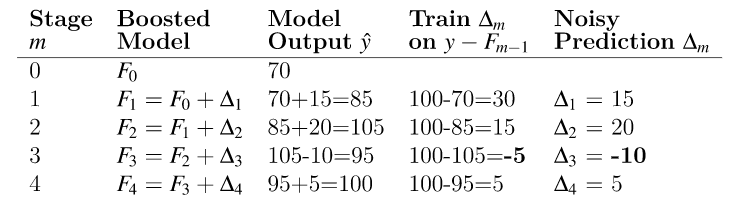
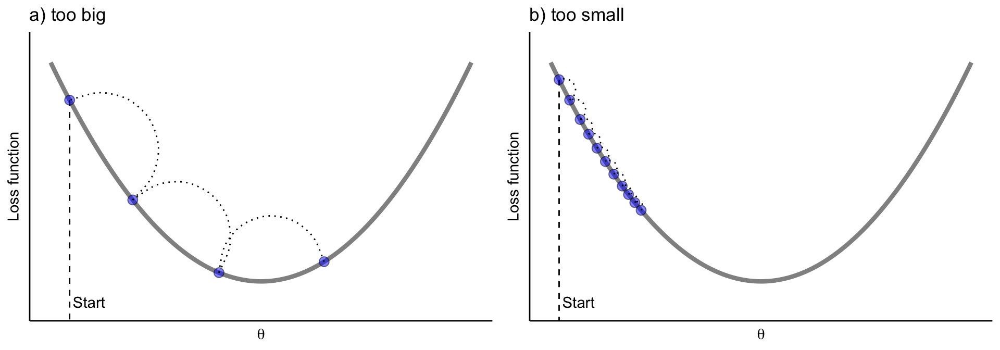
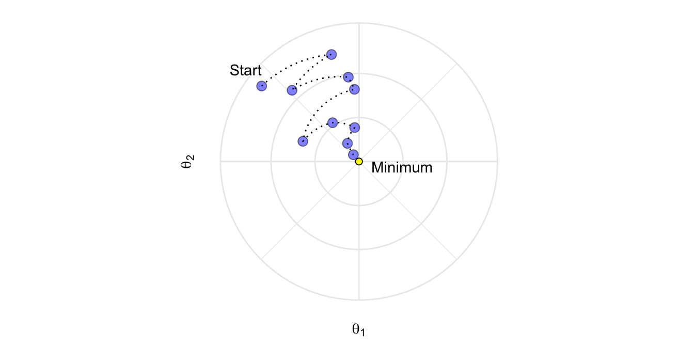

# Boosting

Esta sección describe un método alternativo llamado **boosting**, que es similar al método **bagging**, excepto que los árboles se crean (a veces se dice que *crecen* o se *cultivan*) secuencialmente. Cada árbol sucesivo se crea utilizando información de árboles creados previamente, con el objetivo de minimizar el error de los modelos anteriores ([James et al., 2014](https://link.springer.com/book/10.1007/978-1-4614-7138-7)).

Por ejemplo, dado un modelo de árbol de regresión actual, el procedimiento es el siguiente:

1. Ajustamos un árbol de decisión utilizando los errores residuales del modelo como variable de resultado.
2. Agregamos este nuevo árbol de decisión, ajustado por un parámetro de "contracción" (shrinkage) `lambda`, en la función ajustada para actualizar los residuales. `lambda` es un pequeño valor positivo, normalmente comprendido entre 0.01 y 0.001 y tiene como objetivo controlar el sobreajuste.

.
Este enfoque da como resultado una mejora lenta y sucesiva del modelo ajustado, lo que resulta en un modelo de muy alto rendimiento. El **boosting** tiene diferentes parámetros de ajuste:

- El número de árboles M
- El parámetro de "contracción" `lambda`
- El número de divisiones en cada árbol (pruning).

Existen diferentes variantes de **boosting** como el **Adaboost** (clasificación binaria), **Gradient Boosting** y **Stochastic Gradient Boosting**. Este último, implementado en la liberería de R `xgboost`, es el método más usado comunmente, que implica hacer un remuestreo de observaciones y variables en cada iteración. Es la téncnica que ha demostrado tener un mejor rendimiento. 


La idea del *boosting*, extraída de [aquí](https://explained.ai/gradient-boosting/L2-loss.html), podría verse como un golfista que inicialmente golpea una pelota de golf hacia el hoyo que se encuentra en la posición $y$, pero que solo llega hasta $f_0$. Luego, el golfista golpea la pelota repetidamente de forma más suave, moviéndola hacia el hoyo poco a poco y después de reevaluar la dirección y la distancia al hoyo en cada golpeo. El siguiente diagrama ilustra 5 golpes que llegan al hoyo, $y$, incluidos dos golpes que sobrepasan el hoyo. (Clipart de golfista de http://etc.usf.edu/clipart/)


De forma matemática podríamos decir que una *máquina de aumento de gradiente* (GBM) es un algoritmo de modelado aditivo que construye gradualmente un modelo compuesto agregando iterativamente $M$ submodelos débiles basados en el rendimiento compuesto de las iteraciones anteriores:

$$F_M(x) = \sum_m^M f_m(x).$$

Como hemos dicho anteriromente, la idea es ajustar un modelo de predicción débil (no demasiada buena capacidad predictiva), luego reemplazar los valores de respuesta con los residuos de ese modelo y ajustar otro modelo. Agregar el modelo de predicción residual al modelo de predicción de respuesta original produce un modelo más preciso. GBM repite este proceso una y otra vez, ejecutando nuevos modelos para predecir los residuos de los modelos compuestos anteriores y agregando los resultados para producir nuevos modelos más complejos. Con cada iteración, el modelo se vuelve cada vez más fuerte (mejor predictor). Los árboles sucesivos suelen ponderarse para reducir la velocidad de aprendizaje. La "contracción" reduce la influencia de cada árbol de forma individual y deja margen para que los árboles futuros mejoren el modelo.

$$F_M(x) = f_0 + \eta\sum_{m = 1}^M f_m(x).$$

Cuanto menor sea la tasa de aprendizaje, $\eta$, mayor será el número de árboles necesario, $M$. $\eta$ y $M$ son hiperparámetros. También podríamos usar otras restricciones a los árboles que se usarían como hiperparámetros adicionales como la profundidad del árbol, el número de nodos, las observaciones mínimas por división y la mejora mínima de la pérdida.

El nombre "gradient boosting" se refiere al uso de una metodología *boosting* con "gradiente". Cada iteración de entrenamiento crea un modelo predictor débil y usa los residuos para calcular un gradiente que no es más que la derivada parcial de una función de pérdida. El GBM "desciende el gradiente" para ajustar los parámetros del modelo y reducir el error en la siguiente iteración de entrenamiento.

En el caso de problemas de clasificación, la función de pérdida es el [log-loss](https://www.kaggle.com/dansbecker/what-is-log-loss); para problemas de regresión, la función de pérdida es el error cuadrático medio. GBM continúa hasta que alcanza el número máximo de árboles o un nivel de error aceptable.


Veamos cómo funciona esta metodología con el ejemplo del golfista. La expresión anterior, se puede poner de forma recurrente como

$$
\begin{align*} 
& F_0(x) = f_0(x) \\ 
& F_m(x) = F_{m-1}(x) + \Delta_m(x)
\end{align*}
$$


Después del golpe inicial, el golfista determina el "golpe óptimo" calculando la diferencia entre $y$ y la primera aproximación, $y-f_0(x)$. Esta diferencia generalmente se llama vector residual o residual, pero es útil para aumentar el gradiente pensar en esto como el vector que apunta desde la predicción actual, a la verdadera $y$. Usar el vector residual para nuestro siguiente golpe, significa entrenar $\Delta_m(x)$ en el valor $y - F_{m-1}(x)$ en el modelo anterior (que es más débil). Al igual que con cualquier modelo de aprendizaje automático, nuestros modelos no tendrán un *recall* y *precision* perfectas, por lo que debemos esperar dar una predicción con variabilidad (ruido) en lugar obtener exactamente $y - F_{m-1}(x)$.

Asumamos como ejemplo que el hoyo está a $y=100$ metros y que $f_0(x)=70$. En la siguiente tabla podríamos ver una secuencia del algorirmo GBM en función de la imprecisión de los golpes $\Delta_{m}(x) del golfista:




La implementación de GBM también admitiría una tasa de aprendizaje, $\eta$ que acelera o ralentiza la aproximación a $y$, lo que ayuda a reducir la probabilidad de sobreajuste.


## Cómo funciona el *boosting*

En resumen la idea principal del *boosting* es agregar nuevos modelos al conjunto de modelos de forma secuencial. En esencia, el *boosting* trata de controlar la relación sesgo-varianza comenzando con un modelo débil (por ejemplo, un árbol de decisión con solo unas pocas divisiones) y secuencialmente aumenta su rendimiento al continuar construyendo nuevos árboles, donde cada nuevo árbol en la secuencia intenta arreglar aquellas predicciones dónde el anterior árbol cometió los mayores errores (es decir, cada nuevo árbol en la secuencia se enfocará en las filas de entrenamiento donde el árbol anterior tuvo los mayores errores de predicción). La siguiente figura representa un esquema de esta metodología


## AdaBoost

El algoritmo AdaBoost ([Adaptative Boosting](https://cseweb.ucsd.edu/~yfreund/papers/IntroToBoosting.pdf)) supuso un avance muy importante en el campo del aprendizaje estadístico, ya que hizo posible aplicar la estrategia de boosting a multitud de problemas. Para el funcionamiento de AdaBoost (problema de clasificación binaria) es necesario establecer:

- Un "predictor débil" (weak learner o base learner), que sea capaz de predecir la variable respuesta con un porcentaje de acierto ligeramente superior a lo esperado por azar. En el caso de los árboles de regresión, este weak learner suele ser un árbol con apenas unos pocos nodos, pero también se puede usar regresión logística. 

- Codificar las dos clases de la variable respuesta como +1 y -1.

- Dar un peso inicial e igual para todas las observaciones que forman el conjunto de datos de entrenamiento.

Una vez que estos tres puntos se han establecido, se inicia un proceso iterativo. En la primera iteración, se ajusta el "predictor base" usando los datos de entrenamiento y los pesos iniciales (todos iguales). Con el "predictor base" ajustado y guardado, se predicen las observaciones de entrenamiento y se identifican aquellas bien y mal clasificadas. Con esta información:

- Se actualizan los pesos de las observaciones, disminuyendo el de las que están bien clasificadas y aumentando el de las mal clasificadas.

- Se asigna un peso total al "predictor base", proporcional al total de aciertos. Cuantos más aciertos consiga el "predictor base", mayor será su influencia en el conjunto del predictores ensamblados.

En la siguiente iteración, se llama de nuevo al "predictor base" y se vuelve a ajustar, esta vez, empleando los pesos actualizados en la iteración anterior. El nuevo "predictor base" se guarda, obteniendo así un nuevo modelo para el ensemblado de predictores débiles. Este proceso se repite $M$ veces, generando un total de $M$ "predictores base". Para clasificar nuevas observaciones, se obtiene la predicción de cada uno de los "predictores base" que forman el ensemblado y se agregan sus resultados, ponderando el peso de cada uno acorde al peso que se le ha asignado en el ajuste. El objetivo detrás de esta estrategia es que cada nuevo "predictor base" se centra en predecir correctamente las observaciones que los anteriores no han sido capaces.

El pseudocódigo de este algoritmo sería: 

- $N$: número de observaciones en la muestra de entrenamiento
- $M$: número de iteraciones (número total de "predictores base")
- $G_m$:  "predictor base" en la iteración $m$
- $w_i$: peso de la observación $i$-ésima
- $\alpha_m$: peso del "predictor base" $m$-ésimo

1. Inicializamos los peso de las observaciones como:

$$w_i=\frac{1}{N}, \ \ i=1,2, \cdots, N$$

2. Para $m=1:M$:

     - Ajustar el "predictor base" $G_m$ usiant las observaciones de entrenamiento y los pesos $w_i$.
     - Calcular el error del "predictor base" como:
     $$err_m = \frac{\sum^N_{i=1} w_iI(y_i \neq G_m(x_i))}{\sum^N_{i=1}w_i}$$.
     - Calcular el peso asignado al "predictor base" $G_m$ como:
     $$\alpha_m = log(\frac{1-err_m}{err_m})$$
     - Actualizar los pesos de las observaciones:
     $$w_i = w_i exp[\alpha_m I(y_i \neq G_m(x_i))], \ \ \ i = 1, 2,..., N$$.

3. Predecimos las nuevas observaciones mediante el predictor ensamblado que es la agregación de todos los "predictores base" ponderándolos por su peso:
$$G(x) = sign[\sum^M_{m=1} \alpha_mG_m(x)]$$.

-------------------------------------------------------------------
**EJERCICIO** (Entrega en Moodle: P2-AdaBoost):

Implementa una función para el algoritmo AdaBoost que tenga como "predictor base" la regresión logística. Úsala con el ejemplo de cáncer de mama (breast_train_prep & breast_test_prep) y compara los resultados con los obtenidos mediante LDA que están en este bookdown. 
-------------------------------------------------------------------

    

## GBM básico 

En 1999, Friedman relacionó AdaBoost con conceptos estadísticos importantes (por ejemplo, funciones de pérdida y modelado aditivo), lo que le permitió generalizar el *boosting* a problemas de regresión y funciones de pérdida múltiple ([J. H. Friedman 2001 (modified)](https://statweb.stanford.edu/~jhf/ftp/trebst.pdf)). Esto llevó al modelo típico de GBM que usamos hoy en día y en el que se basan la mayoría de las implementaciones modernas.
     

### Hiperparámetros {#boostingHiperparam}

Un modelo de GBM simple contiene dos categorías de hiperparámetros: hiperparámetros *boosting* y los hiperparámetros específicos del árbol. Los dos principales tipos de hiperparámetros de *boosting* incluyen:

- **Número de árboles**: el número total de árboles en la secuencia o ensamblaje. El promedio de árboles creados de forma independiente en *bagged trees* y *random forest* hace que sea muy difícil sobreajustar con demasiados árboles. Sin embargo, los GBM funcionan de manera diferente ya que cada árbol se crea en secuencia para corregir los errores del árbol anterior. Además, dependiendo de los valores de los otros hiperparámetros, los GBM a menudo requieren muchos árboles (no es raro tener muchos miles de árboles) pero como pueden sobreajustarse fácilmente debemos encontrar el número óptimo de árboles que minimicen la función de pérdida de interés mediante validación cruzada.

- **Tasa de aprendizaje**: determina la contribución de cada árbol en el resultado final y controla la rapidez con que el algoritmo avanza por el descenso del gradiente (predictores) (ver la siguiente figura). Los valores oscilan entre 0 y 1 con valores típicos entre 0.001 y 0.3. Los valores más pequeños hacen que el modelo sea robusto a las características específicas de cada árbol individual, lo que le permite generalizar bien. Los valores más pequeños también facilitan la detención antes del sobreajuste; sin embargo, aumentan el riesgo de no alcanzar el óptimo con un número fijo de árboles y son más exigentes desde el punto de vista informático. Este hiperparámetro también se denomina contracción. Generalmente, cuanto menor sea este valor, más preciso puede ser el modelo, pero también requerirá más árboles en el ensamblaje.
     

   
     
Los dos hiperparámetros del árbol de aprendizaje en un modelo de GBM simple incluyen:

- **Profundidad del árbol**: controla la profundidad de los árboles individuales. Los valores típicos oscilan entre una profundidad de 3 a 8, pero no es raro ver una profundidad de árbol de 1 ([J. Friedman, Hastie y Tibshirani 2001](https://web.stanford.edu/~hastie/Papers/ESLII.pdf)). Los árboles de menor profundidad son computacionalmente eficientes (pero requieren más árboles); sin embargo, los árboles de mayor profundidad permiten que el algoritmo capture interacciones complejas pero también aumentan el riesgo de sobreajuste. Debemos tener en cuenta que valores grandes de $n$ o $p$ en el conjunto de entrenamiento son más tolerantes con árboles profundos. 


- **Número mínimo de observaciones en nodos terminales**: Además, controla la complejidad de cada árbol. Dado que tendemos a utilizar árboles más cortos, esto rara vez tiene un gran impacto en el rendimiento. Los valores típicos oscilan entre 5 y 15, donde los valores más altos ayudan a evitar que un modelo aprenda relaciones que pueden ser muy específicas para la muestra particular seleccionada para un árbol (sobreajuste) pero los valores más pequeños pueden ayudar con las clases objetivo desequilibradas en los problemas de clasificación.

### Implementación


Hay muchas librería que implementan GBM y variantes de GBM. Podemos encontrar una lista bastante completa en la Vista de tareas de aprendizaje automático de CRAN: https://cran.r-project.org/web/views/MachineLearning.html. Sin embargo, la implementación de R original más popular del algoritmo GBM de Friedman ([J. H. Friedman 2001](https://www.jstor.org/stable/2699986?seq=1); [Friedman 2002](https://www.sciencedirect.com/science/article/abs/pii/S0167947301000652)) es el paquete `gbm`.


`gbm` tiene dos funciones de entrenamiento: `gbm::gbm()` y `gbm::gbm.fit()`. La principal diferencia es que `gbm::gbm()` usa la interfaz de fórmulas para especificar su modelo, mientras que `gbm::gbm.fit()` requiere las matrices $x$ e $y$ separadas; `gbm::gbm.fit()` es más eficiente y su uso es recomendado para usuarios avanzados.

La configuración predeterminada en `gbm` incluye una tasa de aprendizaje (constricción) de 0.001. Esta es una tasa de aprendizaje muy pequeña y normalmente requiere una gran cantidad de árboles para minimizar suficientemente la función de pérdida. Sin embargo, `gbm` usa un número predeterminado de árboles de 100, que rara vez es suficiente. En consecuencia, comenzamos con una tasa de aprendizaje de 0.1 y aumentamos la cantidad de árboles para entrenar. La profundidad predeterminada de cada árbol (profundidad de interacción) es 1, lo que significa que estamos agrupando un montón de elementos de decisión (es decir, no podemos capturar ningún efecto de interacción). 

Para el conjunto de datos de sillitas de coches, aumentamos la profundidad del árbol a 3 y usamos el valor predeterminado para el número mínimo de observaciones requeridas en los nodos terminales de los árboles (n.minobsinnode). Por último, establecemos `cv.folds = 10` para realizar un CV de 10 veces.


```{r}
library(gbm)
set.seed(1234)

md1_gbm <- gbm(
  formula = Sales ~ .,
  data = cs_train,
  distribution = "gaussian",  # SSE loss function
  n.trees = 500,
  shrinkage = 0.1,
  interaction.depth = 3,
  n.minobsinnode = 10,
  cv.folds = 10
)

# find index for number trees with minimum CV error
best <- which.min(md1_gbm$cv.error)

# get MSE and compute RMSE
sqrt(md1_gbm$cv.error[best])
```

Nuestros resultados muestra un SSE obtenido mediante validación cruzada de `r round(sqrt(md1_gbm$cv.error[best]), 2)` que se alcanza con 120 árboles.


```{r}
# plot error curve
gbm.perf(md1_gbm, method = "cv")
```


También podemos hacer lo mismo con `caret`
```{r}
set.seed(1234)
garbage <- capture.output(
cs_mdl_gbm <- train(
   Sales ~ ., 
   data = cs_train, 
   method = "gbm",
   tuneLength = 5,
   trControl = cs_trControl
))
cs_mdl_gbm
```

Que no es tan fino y se obtienen diferentes resultados

### Estrategia general de *tuning* 

A diferencia de los bosques aleatorios, los GBM pueden tener una alta variabilidad en la precisión dependiendo de la configuración de sus hiperparámetros ([Probst, Bischl y Boulesteix 2019](https://www.jmlr.org/papers/volume20/18-444/18-444.pdf)). Por lo tanto, el ajuste puede requerir mucha más estrategia que un modelo de bosque aleatorio. A menudo, un buen enfoque es:

1. Elegir una tasa de aprendizaje relativamente alta. Generalmente, el valor predeterminado de 0.1 funciona, pero valores entre 0.05 y 0.2 debería funcionar en una amplia gama de problemas.
2. Determinar el número óptimo de árboles para esta tasa de aprendizaje.
3. Corregir los hiperparámetros del árbol y ajuste la tasa de aprendizaje y evaluar la velocidad frente al rendimiento.
4. Ajustar los parámetros específicos del árbol para determinar la tasa de aprendizaje.
5. Una vez que se han encontrado los parámetros específicos del árbol, reducir la tasa de aprendizaje para evaluar cualquier mejora en la precisión.
6. Utilizar la configuración de hiperparámetros finales y aumente los procedimientos de CV para obtener estimaciones más sólidas. A menudo, los pasos anteriores se realizan con un procedimiento de validación simple o un CV de 5 veces debido a restricciones computacionales. Si utilizó k-fold CV en los pasos 1 a 5, este paso no es necesario.

Ya hemos hecho los pasos (1) - (2) en el ejemplo anterior con nuestro primer modelo de GBM. A continuación, haremos (3) y evaluaremos el rendimiento de varios valores de tasa de aprendizaje entre 0.005 y 0.3. Nuestros resultados indican que una tasa de aprendizaje de 0.05 minimiza suficientemente nuestra función de pérdida y requiere 260 árboles. 

Todos nuestros modelos tardan un poco más de 3 segundos en entrenarse, por lo que no vemos ningún impacto significativo en el tiempo de entrenamiento según la tasa de aprendizaje.


```{r}
# create grid search
hyper_grid <- expand.grid(
  learning_rate = c(0.3, 0.1, 0.05, 0.01, 0.005),
  RMSE = NA,
  trees = NA,
  Time = NA
)

# execute grid search
for(i in seq_len(nrow(hyper_grid))) {

# fit gbm
  set.seed(123)  # for reproducibility
  train_time <- system.time({
    m <- gbm(
      Sales ~ ., 
      data = cs_train, 
      distribution = "gaussian",
      n.trees = 500, 
      shrinkage = hyper_grid$learning_rate[i], 
      interaction.depth = 3, 
      n.minobsinnode = 10,
      cv.folds = 10 
   )
  })
  
  # add SSE, trees, and training time to results
  hyper_grid$RMSE[i]  <- sqrt(min(m$cv.error))
  hyper_grid$trees[i] <- which.min(m$cv.error)
  hyper_grid$Time[i]  <- train_time[["elapsed"]]

}

# results
arrange(hyper_grid, RMSE)
```

A continuación, estableceremos nuestra tasa de aprendizaje en el nivel óptimo (0.05) y el número de árboles a 260 para ajustar los hiperparámetros específicos del árbol (`interaction.depth` y `n.minobsinnode`). El ajuste de los parámetros específicos del árbol nos proporciona una reducción adicional del RMSE si consideramos `n.minobsinnode=5` (afinamos más en casos raros).


```{r}
hyper_grid <- expand.grid(
  n.trees = 250,
  shrinkage = 0.05,
  interaction.depth = c(3, 5, 7),
  n.minobsinnode = c(5, 10, 15)
)

# create model fit function
model_fit <- function(n.trees, shrinkage, interaction.depth, n.minobsinnode) {
  set.seed(123)
  m <- gbm(
    Sales ~ ., 
    data = cs_train, 
    distribution = "gaussian",
    n.trees = n.trees,
    shrinkage = shrinkage,
    interaction.depth = interaction.depth,
    n.minobsinnode = n.minobsinnode,
    cv.folds = 10
  )
  # compute RMSE
  sqrt(min(m$cv.error))
}

# perform search grid with functional programming
hyper_grid$rmse <- purrr::pmap_dbl(
  hyper_grid,
  ~ model_fit(
    n.trees = ..1,
    shrinkage = ..2,
    interaction.depth = ..3,
    n.minobsinnode = ..4
    )
)

# results
arrange(hyper_grid, rmse)
```


También podemos ver cómo hacer esto con `caret` en este [link](https://topepo.github.io/caret/model-training-and-tuning.html#customizing-the-tuning-process).  


## GBMs estocásticos 

Una idea importante propuesda por Breiman ([Breiman (1996a)](https://link.springer.com/content/pdf/10.1007/BF00058655.pdf); [Breiman (2001)](https://link.springer.com/article/10.1023/A:1010933404324)) al desarrollar sus algoritmos de *bagged* y *random forest* fue que entrenar el algoritmo en una submuestra aleatoria del conjunto de datos de entrenamiento ofreció una reducción adicional en la correlación de árboles y, por lo tanto, una mejora en precisión de predicción. [Friedman (2002)](https://dl.acm.org/doi/10.1016/S0167-9473(01)00065-2) utilizó esta misma lógica y actualizó el algoritmo de *boosting* usando esta idea. Este procedimiento se conoce como **aumento de gradiente estocástico** y, como se ilustra en la siguiente Figura, ayuda a reducir las posibilidades de quedarse atascado en mínimos locales, mesetas y otros terrenos irregulares de la función de pérdida para que podamos encontrar un óptimo casi global.





### Hiperparámetros estocásticos

Hay algunas variantes de aumento de gradiente estocástico que se pueden utilizar, todas las cuales tienen hiperparámetros adicionales:

- **Muestrear fila antes de crear cada árbol** (disponible en **gbm**, **h2o** y **xgboost**). - **Muestrear columnas antes de crear cada árbol** (`h2o` y `xgboost`)
- **Muestrear columnas antes de considerar cada división en cada árbol** (`h2o` y `xgboost`)

En general, el muestreo "agresivo" de filas, como la selección de solo el 50% o menos de los datos de entrenamiento, ha demostrado ser beneficioso y los valores típicos oscilan entre 0.5 y 0.8. El muestreo de columnas y el impacto en el rendimiento depende en gran medida de la naturaleza de los datos y de si existe una fuerte multicolinealidad o muchas características ruidosas. Similar a la selección de `mtry` en el *random forest*, si hay menos predictores relevantes (más datos ruidosos), los valores más altos de submuestreo de columnas tienden a funcionar mejor porque hace que sea más probable seleccionar aquellas características con la señal más fuerte. Cuando hay muchos predictores relevantes, los valores más bajos de submuestreo de columnas tienden a funcionar bien.

Veamos cómo hacer este proceso con `h20` (no ejecutado, muy costoso computacionalmente)

```{r, eval=FALSE}
library(h2o)
# refined hyperparameter grid
hyper_grid <- list(
  sample_rate = c(0.5, 0.75, 1),              # row subsampling
  col_sample_rate = c(0.5, 0.75, 1),          # col subsampling for each split
  col_sample_rate_per_tree = c(0.5, 0.75, 1)  # col subsampling for each tree
)

# random grid search strategy
search_criteria <- list(
  strategy = "RandomDiscrete",
  stopping_metric = "mse",
  stopping_tolerance = 0.001,   
  stopping_rounds = 10,         
  max_runtime_secs = 60*60      
)

# active connection to h2o (required)
h2o.init(max_mem_size = "10g")

# define variables
train_h2o <- as.h2o(cs_train)
response <- "Sales"
predictors <- setdiff(colnames(cs_train), response)

# perform grid search 
grid <- h2o.grid(
  algorithm = "gbm",
  grid_id = "gbm_grid",
  x = predictors, 
  y = response,
  training_frame = train_h2o,
  hyper_params = hyper_grid,
  ntrees = 500,
  learn_rate = 0.01,
  max_depth = 7,
  min_rows = 5,
  nfolds = 10,
  stopping_rounds = 10,
  stopping_tolerance = 0,
  search_criteria = search_criteria,
  seed = 123
)

# collect the results and sort by our model performance metric of choice
grid_perf <- h2o.getGrid(
  grid_id = "gbm_grid", 
  sort_by = "mse", 
  decreasing = FALSE
)

grid_perf
```

## XGBoost

Extreme gradient boosting  (XGBoost) es una librería optimizada de GBM distribuido (paralelo) que está diseñada para ser eficiente, flexible y portátil en varios idiomas ([Chen y Guestrin 2016] (https://doi.org/10.1145/2939672.2939785.)). Aunque XGBoost proporciona las mismas opciones de hiperparámetros basados en el *boosting* y los métodos que usan árboles ilustrados en las secciones anteriores, también proporciona algunas ventajas sobre el *boosting* tradicional, como:

- **Regularización**: XGBoost ofrece hiperparámetros de regularización adicionales, que discutiremos a continuación, que añaden protección adicional contra el sobreajuste.
- **Detención anticipada**: similar a `h2o`, `XGBoost` implementa la detención anticipada para que podamos detener la evaluación del modelo cuando los árboles adicionales no ofrecen ninguna mejora.
- **Procesamiento en paralelo**: dado que el aumento de gradiente es de naturaleza secuencial, es extremadamente difícil de paralelizar. XGBoost ha implementado procedimientos para admitir la compatibilidad de GPU y Spark, lo que le permite ajustar el aumento de gradiente utilizando potentes ordenadores/sistemas de procesamiento distribuido.
- **Funciones de pérdida**: XGBoost permite a los usuarios definir y optimizar modelos de aumento de gradiente utilizando criterios de evaluación y objetivos personalizados.
- **Continuar con el modelo existente**: un usuario puede entrenar un modelo XGBoost, guardar los resultados y luego regresar a ese modelo y continuar construyendo sobre los resultados. Ya sea porque se desee revisar los resultados intermedios o haya creado configuraciones de hiperparámetros adicionales para evaluar. XGBoost permite continuar entrenando un modelo sin comenzar desde cero.
- **Permite tener diferentes "predictores base"** : la mayoría de las implementaciones de GBM se crean con árboles de decisión, pero XGBoost también permite el uso de modelos lineales generalizados.
- **Múltiples lenguajes**: XGBoost ofrece implementaciones en R, Python, Julia, Scala, Java y C ++.


Además de estar implementado en distintos lenguajes, XGboost se puede llevar a cabo de varias formas dentro de R. La implementación principal de R es el paquete `xgboost`; sin embargo, también se puede usar `caret` (basta usar `method="xgbTree"`). Podríamos usar este código:

```{r}
tune_grid <- expand.grid(nrounds = 200,
                        max_depth = 5,
                        eta = 0.05,
                        gamma = 0.01,
                        colsample_bytree = 0.75,
                        min_child_weight = 0,
                        subsample = 0.5)

rf_fit <- train(Sales ~., 
                data = cs_train, 
                method = "xgbTree",
                trControl=cs_trControl,
                tuneGrid = tune_grid,
                tuneLength = 10)
rf_fit
```


El paquete `h2o` también ofrece una implementación de XGBoost. Mostraremos cómo usar `xgboost`. 


Como se mencionó anteriormente, `xgboost` permite los hiperparámetros tradicionales para *boosting* y árboles de decisión que discutimos hemos descrito en la Sección \@ref{boostingHiperparam} . Sin embargo, `xgboost` también proporciona hiperparámetros adicionales que pueden ayudar a reducir las posibilidades de sobreajuste, lo que genera menos variabilidad de predicción y, por lo tanto, una mayor precisión.


### Reguralización

`xgboost` proporciona múltiples parámetros de regularización para ayudar a reducir la complejidad del modelo y evitar el sobreajuste. El primero, `gamma`, es un hiperparámetro de pseudo-regularización conocido como multiplicador lagrangiano y controla la complejidad de un árbol dado. `gamma` especifica una reducción de pérdida mínima requerida para hacer una partición adicional en un nodo hoja del árbol. Cuando se especifica `gamma`, `xgboost` hará crecer el árbol a la profundidad máxima especificada, pero luego lo podará para encontrar y eliminar divisiones que no cumplan con la gamma especificada. `gamma` tiende a valer la pena explorar a medida que los árboles en el GBM se vuelven más profundos y cuando ve una diferencia significativa del error de CV entre el la muestra "train" y "test". El valor de gamma oscila entre $0-\infty$ (0 significa que no hay restricciones, mientras que números grandes significan una mayor regularización). Lo que se cuantifica como un valor de `gamma` grande depende de la función de pérdida, pero generalmente valores  entre 1 y 20 serán suficientes si `gamma` es necesario.

Dos parámetros de regularización más tradicionales incluyen `alpha` (reguralización $L_1$) y `lambda` (reguralización $L_2$) [NOTA: lo veréis el año que viene en la asignatura de Modelos avanzados, ahora podéis leer [esto](https://www.iartificial.net/regularizacion-lasso-l1-ridge-l2-y-elasticnet/)]. Estos parámetros de regularización limitan cómo de grandes pueden llegar a ser los pesos (o la influencia) de las hojas de un árbol.

Los tres hiperparámetros (`gamma`, `alpha`, `lambda`) funcionan para limitar la complejidad del modelo y reducir el sobreajuste. aunque `gamma` es lo que más se usa en estos modelos, la estrategia de ajuste debe explorar el impacto de los tres. La siguiente figura ilustra cómo la regularización puede hacer que un modelo de sobreajuste sea más conservador en los datos de entrenamiento, lo que, en algunas circunstancias, puede resultar en mejoras en el error de validación.


### Estrategia de *tuning*


La estrategia de ajuste general para explorar los hiperparámetros de `xgboost` se basa en las estrategias de ajuste básicas y estocásticas de GBM:

1. Aumentar el número de árboles y ajustar la velocidad de aprendizaje con una parada temprana
2. Ajustar hiperparámetros específicos del árbol
3. Explorar los atributos estocásticos de GBM
4. Si se produce un sobreajuste sustancial (por ejemplo, grandes diferencias entre la muestra "train" y el error de CV), explorar los hiperparámetros de regularización
5. Si encontramos valores de hiperparámetros que son sustancialmente diferentes de la configuración predeterminada, asegurarnos de volver a ajustar la tasa de aprendizaje.
6. Obtener el modelo "óptimo" final
     
La ejecución de un modelo XGBoost con `xgboost` requiere una preparación adicional de datos. `xgboost` requiere una entrada matricial de las variables predictoras y la respuesta. En consecuencia, para proporcionar una entrada matricial de las variables, necesitamos codificar nuestras variables categóricas numéricamente (es decir, hacer *dummies*). Como ya sabemos, esto se puede hacer fácilmente con la librería `recipies`

```{r}
library(recipes)
xgb_prep <- recipe(Sales ~ ., data = cs_train) %>%
  step_integer(all_nominal()) %>%
  prep(training = cs_train, retain = TRUE) %>%
  juice()  # similar to bake

X <- as.matrix(xgb_prep[setdiff(names(xgb_prep), "Sales")])
Y <- xgb_prep$Sales
```


> **NOTA**: `xgboost` permite tres tipos diferentes de matrices para los predictores: matriz R ordinaria, matrices esparsas de la lilbrería `Matrix` u objetos internos `xgb.DMatrix` de `xgboost`. Consultar ?Xgboost::xgboost para obtener más detalles.

A continuación, pasamos por una serie de búsquedas en cuadrículas (*grid search*) similares a las secciones anteriores y encontramos que los siguientes hiperparámetros del modelo (proporcionados a través del argumento `params`) funcionan bastante bien. Nuestro RMSE es ligeramente más bajo que los mejores modelos GBM regulares y estocásticos hasta ahora.


```{r}
library(xgboost)
set.seed(123)
mod_xgb <- xgb.cv(
  data = X,
  label = Y,
  nrounds = 500,
  objective = "reg:squarederror",
  early_stopping_rounds = 50, 
  nfold = 10,
  params = list(
    eta = 0.1,
    max_depth = 5,
    min_child_weight = 0,
    subsample = 0.8,
    colsample_bytree = 0.75),
  verbose = 0
)  


# minimum test CV RMSE
min(mod_xgb$evaluation_log$test_rmse_mean)
```

En este ejemplo no parece que mejoremos el RMSE, pero no suele ser lo habitual. 

A continuación, evaluamos si el sobreajuste está limitando el rendimiento de nuestro modelo al realizar una búsqueda en cuadrícula que examina varios parámetros de regularización (`gamma`, `lambda` y `alfa`). Dado el alto coste computacional, no ejecutamos este código, pero puede comprobarse que no mejoramos con la inclusión de hiperparámetros de reguralización. 


```{r, eval=FALSE}
# hyperparameter grid
hyper_grid <- expand.grid(
  eta = 0.01,
  max_depth = 3, 
  min_child_weight = 3,
  subsample = 0.5, 
  colsample_bytree = 0.5,
  gamma = c(0, 1, 10, 100, 1000),
  lambda = c(0, 1e-2, 0.1, 1, 100, 1000, 10000),
  alpha = c(0, 1e-2, 0.1, 1, 100, 1000, 10000),
  rmse = 0,          # a place to dump RMSE results
  trees = 0          # a place to dump required number of trees
)

# grid search
for(i in seq_len(nrow(hyper_grid))) {
  set.seed(123)
  m <- xgb.cv(
    data = X,
    label = Y,
    nrounds = 500,
    objective = "reg:squarederror",
    early_stopping_rounds = 50, 
    nfold = 10,
    verbose = 0,
    params = list( 
      eta = hyper_grid$eta[i], 
      max_depth = hyper_grid$max_depth[i],
      min_child_weight = hyper_grid$min_child_weight[i],
      subsample = hyper_grid$subsample[i],
      colsample_bytree = hyper_grid$colsample_bytree[i],
      gamma = hyper_grid$gamma[i], 
      lambda = hyper_grid$lambda[i], 
      alpha = hyper_grid$alpha[i]
    ) 
  )
  hyper_grid$rmse[i] <- min(m$evaluation_log$test_rmse_mean)
  hyper_grid$trees[i] <- m$best_iteration
}

# results
hyper_grid %>%
  filter(rmse > 0) %>%
  arrange(rmse) %>%
  glimpse()
```
Una vez que hayamos encontrado los hiperparámetros óptimos, ajustaremos el modelo final con `xgb.train` o `xgboost`. Debemos asegurarnos de  utilizar la cantidad óptima de árboles encontrados durante la validación cruzada. En nuestro ejemplo, agregar regularización no proporciona ninguna mejora, por lo que los excluimos en nuestro modelo final.


```{r}
# optimal parameter list  (not are the real ones)
params <- list(
  eta = 0.01,
  max_depth = 3,
  min_child_weight = 3,
  subsample = 0.5,
  colsample_bytree = 0.5
)

# train final model
xgb.fit.final <- xgboost(
  params = params,
  data = X,
  label = Y,
  nrounds = 3944,
  objective = "reg:squarederror",
  verbose = 0
)

xgb.fit.final
``` 

**NOTA**: Podemos obtener un ránking con la importancia de cada variable

```{r}
vip::vip(xgb.fit.final) 
```

## Otros algoritmos GBM 

Los GBM son uno de los algoritmos más potentes que hay para crear modelos predictivos. Aunque son menos intuitivos y más exigentes computacionalmente que muchos otros algoritmos de aprendizaje automático, es esencial estar familizarizados con ellos.

Aunque discutimos los algoritmos GBM más populares, debemos tener en cuenta que actualmente se están llevando a cabo mejoras mediante la creación de algoritmos alternativos que no veremos en este curso. Por ejemplo, LightGBM ([Ke et al. 2017](https://papers.nips.cc/paper/2017/hash/6449f44a102fde848669bdd9eb6b76fa-Abstract.html)) es una librería de que se basa en el crecimiento de árboles por hojas versus el crecimiento tradicional de árboles por niveles. Esto significa que a medida que un árbol crece más profundo, se enfoca en extender una sola rama en lugar de cultivar múltiples ramas. `CatBoost` ([Dorogush, Ershov y Gulin 2018](https://arxiv.org/abs/1810.11363)) es otra librería que se basa en el uso de métodos eficientes para codificar variables categóricas durante el proceso de aumento de gradiente. Ambos librerías están disponibles en R.
