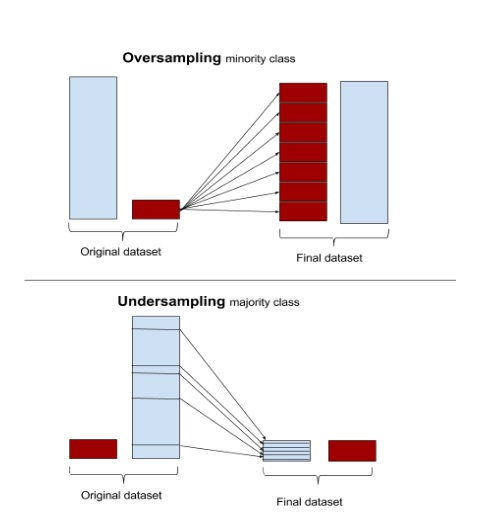

# Respuesta no balanceada

Cuando nos enfrentamos a problemas de clasificación en datos reales, puede ser un desafío tratar con un caso en el que una clase supera con creces a la otra (también conocidas como clases desequilibradas). En terminos prácticos podríamos, por ejemplo, predecir todos los inviduos como la categoría más frecuente y mejoraríamos la precisión que, como vimos en capítulos anteriores, por azar es del 50%. 

Estas son algunas de las técnicas más populares para tratar con el desequilibrio de clases, pero existen más. Proporcionamremos una descripción general rápida. 


- *Asignar pesos a cada clase*: imponemos un coste mayor cuando se cometen errores en la clase minoritaria

- *Muestreo descendente (under-sampling)*: eliminar observaciones al azar en la clase mayoritaria

- *Muestreo ascendente (oversampling)*: replicar aleatoriamente observaciones en la clase minoritaria

- Además del muestreo descendente y ascendente, existen métodos híbridos que combinan el muestreo descendente con la generación de datos adicionales. Dos de los más populares son [ROSE](https://journal.r-project.org/archive/2014/RJ-2014-008/RJ-2014-008.pdf) y [SMOTE](https://www.jair.org/index.php/jair/article/view/10302). El primer método necesita tener instalada la librería `ROSE` y el segundo la librería `DMwR`.





Si queréis podéis encontrar una descripción más detallada en esta publicación de blog de [Silicon Valley Data Science](https://www.svds.com/learning-imbalanced-classes/).

Estos métodos también funcionan para los problemas multi-clase. En [este artículo](https://link.springer.com/article/10.1007/s13748-016-0094-0) tenéis más información general sobre el tema. 


Debemos tener en cuenta que, en realidad, no deberíamos simplemente realizar un muestreo descendente o ascendente en nuestros datos de entrenamiento y luego ejecutar el modelo. Debemos tener en cuenta la validación cruzada y realizar un muestreo descendente o ascendente en cada sub-muestra de forma independiente para obtener una estimación real del rendimiento del modelo.


También es importante señalar que estas técnicas de ponderación y muestreo tienen mayor impacto en métricas de evaluación del modelo como la precisión, porque mueven artificialmente el umbral para estar más cerca de lo que podría considerarse como la ubicación "óptima" en una curva ROC. Otras métricas como el AUC o la tasa de falsos o verdaderos positivos no se ven tan afectadas. 


Ilustremos cómo llevar a cabo estas técnicas con nuestro ejemplo de cáncer de mama. Usaremos los datos que ya están preprocesados según se hizo en la Sección \@ref(caret) y que se encuentran en los objetos `breast_train_prep` y `breast_test_prep`. Efectivamente, los datos para este problema están desbalanceados respecto a la variable que queremos predecir

```{r}
table(breast_test_prep$diagnosis)
```

Afortunadamente, la librería `caret` hace que sea muy fácil incorporar técnicas de muestreo descendente y ascendente incluyendo validación cruzada. Simplemente basta con utilizar el argumento `sampling` en nuestro `trainControl()` y escoger el método "down" o "up" según nos convenga. El resto del proceso de creación de modelo permanece igual que los pasos llevados con cualquier otro método que hemos visto, por ejemlo KNN.


```{r}
ctrl <- trainControl(method = "repeatedcv", 
                     number = 10, 
                     repeats = 5, 
                     verboseIter = FALSE,
                     sampling = "down")

set.seed(1234)
model_knn_under <- caret::train(diagnosis ~ .,
                         data = breast_train_prep,
                         method = "knn",
                         trControl = ctrl)
model_knn_under

```


```{r}
cm_under <- confusionMatrix(breast_test_prep$diagnosis,
                            predict(model_knn_under, 
                                     newdata = breast_test_prep))
cm_under
```

Podemos comparar esta capacidad predictiva con la que tiene el modelo obiviando el problema del desbalanceo y que se estimaría así:

```{r}
crtl <- trainControl(method = "repeatedcv",
                     number = 10,  
                     repeats = 10,
                     verboseIter = FALSE)
model_knn <- caret::train(diagnosis ~ .,
                          data = breast_train_prep,
                          method = "knn",
                          trControl = ctrl)
```


```{r}
cm_original <- confusionMatrix(breast_test_prep$diagnosis,
                               predict(model_knn, 
                                    newdata = breast_test_prep))
cm_original
```


Estimemos ahora el modelo con un muestreo ascendente y usando, por ejemplo SMOTE   (ROSE sea haría igual usando `sampling="rose"`)


```{r}
#
# OVER
#
ctrl <- trainControl(method = "repeatedcv", 
                     number = 10, 
                     repeats = 5, 
                     verboseIter = FALSE,
                     sampling = "up")
model_knn_over <- caret::train(diagnosis ~ .,
                         data = breast_train_prep,
                         method = "knn",
                         trControl = ctrl)

cm_over <- confusionMatrix(breast_test_prep$diagnosis,
                            predict(model_knn_over, 
                                     newdata = breast_test_prep))


#
# SMOTE
#
ctrl <- trainControl(method = "repeatedcv", 
                     number = 10, 
                     repeats = 5, 
                     verboseIter = FALSE,
                     sampling = "smote")
model_knn_smote <- caret::train(diagnosis ~ .,
                         data = breast_train_prep,
                         method = "knn",
                         trControl = ctrl)

cm_smote <- confusionMatrix(breast_test_prep$diagnosis,
                            predict(model_knn_smote, 
                                     newdata = breast_test_prep))
```


Y podemos comparar las predicciones con la función `resamples` (para introducir variabilidad)


```{r}
models <- list(original = model_knn,
               under = model_knn_under,
               over = model_knn_over,
               smote = model_knn_smote)

resampling <- resamples(models)
bwplot(resampling)
```

O compararlas con otras métricas


```{r}
library(dplyr)

select_measures <- c("Sensitivity", "Specificity", "Precision",
                     "Recall", "F1")

comparison <- NULL
for (name in names(models)) {
  model <- get(paste0("cm_", name))
  comparison.i <- model$byClass[select_measures]
  comparison <- rbind(comparison, comparison.i) %>% as_tibble()
}
comparison <- comparison %>% 
  add_column(model=names(models), .before=TRUE)

comparison

library(tidyr)
comparison %>%
  gather(x, y, Sensitivity:F1) %>%
  ggplot(aes(x = x, y = y, color = model)) +
    geom_jitter(width = 0.2, alpha = 0.5, size = 3)
```

