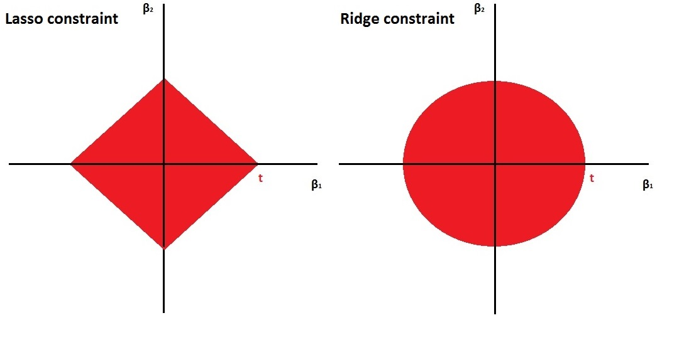

# Modelos de regularización

## Introducción
En este capítulo, exploraremos los modelos de regularización (y el concepto de regresión penalizada), que es una técnica poderosa para lidiar con el sobreajuste en modelos de aprendizaje automático. El sobreajuste ocurre cuando un modelo se ajusta demasiado bien a los datos de entrenamiento pero tiene un rendimiento deficiente en datos no vistos. La regularización es un método que introduce un término de penalización en la función de pérdida del modelo para evitar el sobreajuste. A grandes rasgos podemos resumir que


Hay dos tipos comunes de regularización utilizados en la regresión penalizada:

1. Regularización L1 (Regresión Lasso): Agrega el valor absoluto de los coeficientes como término de penalización a la función de pérdida.

2. Regularización L2 (Regresión Ridge): Agrega el cuadrado de los coeficientes como término de penalización a la función de pérdida.

La regularización ridge es suave y la regularización lasso es áspera tal y como se puede ver en la siguiente figura



Es esta diferencia entre las restricciones suaves y ásperas lo que resulta en que el Lasso tenga estimaciones de coeficientes que son exactamente cero, mientras que Ridge no lo hace. Ilustramos esto aún más en la siguiente figura. La solución de mínimos cuadrados se marca como $\hat{\beta}$, mientras que el diamante azul y el círculo representan las restricciones de regresión Lasso y Ridge (como en la Figura anterior). Si la penalización ($t$ en la figura anterior) es lo suficientemente grande (aumentar la penalización hace que el diamante y el círculo sean más grandes, respectivamente), entonces las regiones de restricción contendrán a $\hat{\beta}$, por lo que las estimaciones de Ridge y Lasso serán iguales a las estimaciones de mínimos cuadrados.

Las curvas que están centradas alrededor de $\hat{\beta}$ representan regiones de RSS constante. A medida que las elipses se alejan de las estimaciones de coeficientes de mínimos cuadrados, el RSS aumenta. Las estimaciones de coeficientes de regresión Lasso y Ridge se dan en el primer punto en el que una elipse toca la región de restricción.


La regularización proporciona varios beneficios:

- Ayuda a prevenir el sobreajuste al reducir la complejidad del modelo.
- Mejora la generalización, lo que hace que el modelo tenga un mejor rendimiento en datos no vistos.
- Puede realizar automáticamente la selección de características al establecer algunos coeficientes en cero.

Regularización L1 (Regresión Lasso)
La regresión Lasso agrega la suma de los valores absolutos de los coeficientes como término de penalización a la función de pérdida. Esta penalización fomenta que algunos coeficientes sean exactamente cero, lo que efectivamente realiza la selección de características.


## Cómo regularizar

El procedimiento habitual para ajustar un modelo de regresión lineal es emplear mínimos cuadrados, es decir, utilizar como criterio de error la suma de cuadrados residual

$$\mbox{RSS} = \sum\limits_{i=1}^{n}\left(  y_{i} - \beta_0 - \boldsymbol{\beta}^t \mathbf{x}_{i} \right)^{2}$$

Si el modelo lineal es razonablemente adecuado, utilizar RSS  va a dar lugar a estimaciones con poco sesgo, y si además  $n\gg p$, entonces el modelo también va a tener poca varianza. Las dificultades surgen cuando  $p$ es grande o cuando hay correlaciones altas entre las variables predictoras: tener muchas variables dificulta la interpretación del modelo, y si además hay problemas de colinealidad o se incumple  $n\gg p$, entonces la estimación del modelo va a tener muchas varianza y el modelo estará sobreajustado. La solución pasa por forzar a que el modelo tenga menos complejidad para así reducir su varianza. Una forma de conseguirlo es mediante la regularización (regularization o shrinkage) de la estimación de los parámetros  $\beta_1, \beta_2,\ldots, \beta_p$ que consiste en considerar todas las variables predictoras pero forzando a que algunos de los parámetros se estimen mediante valores muy próximos a cero, o directamente con ceros. Esta técnica va a provocar un pequeño aumento en el sesgo pero a cambio una notable reducción en la varianza y una interpretación más sencilla del modelo resultante.

Como ya hemos anticipado, hay dos formas básicas de lograr esta simplificación de los parámetros (con la consiguiente simplificación del modelo), utilizando una penalización cuadrática (norma $L_2$) o en valor absoluto (norma  $L_1$):

Hay dos formas básicas de lograr esta simplificación de los parámetros (con la consiguiente simplificación del modelo), utilizando una penalización cuadrática (norma $L_2$) o en valor absoluto (norma $L_1$):

- *Ridge regression* 
    $$\mbox{min}_{\beta_0, \boldsymbol{\beta}} \mbox{RSS} + \lambda\sum_{j=1}^{p}\beta_{j}^{2}$$
    
    Equivalentemente,
    $$\mbox{min}_{\beta_0, \boldsymbol{\beta}} \mbox{RSS}$$
    sujeto a
    $$\sum_{j=1}^{p}\beta_{j}^{2} \le s$$

- *Lasso* [*least absolute shrinkage and selection operator*]
    $$\mbox{min}_{\beta_0, \boldsymbol{\beta}} RSS + \lambda\sum_{j=1}^{p}|\beta_{j}|$$
    
    Equivalentemente,
    $$\mbox{min}_{\beta_0, \boldsymbol{\beta}} \mbox{RSS}$$
    sujeto a
    $$\sum_{j=1}^{p}|\beta_{j}| \le s$$
    
Una formulación unificada consiste en considerar el problema
$$\mbox{min}_{\beta_0, \boldsymbol{\beta}} RSS + \lambda\sum_{j=1}^{p}|\beta_{j}|^d$$

Si $d=0$, la penalización consiste en el número de variables utilizadas, por tanto se corresponde con el problema de selección de variables; $d=1$ se corresponde con *lasso* y $d=2$ con *ridge*.

La ventaja de utilizar *lasso* es que va a forzar a que algunos parámetros sean cero, con lo cual también se realiza una selección de las variables más influyentes. 
Por el contrario, *ridge regression* va a incluir todas las variables predictoras en el modelo final, si bien es cierto que algunas con parámetros muy próximos a cero: de este modo va a reducir el riesgo del sobreajuste, pero no resuelve el problema de la interpretabilidad. 
Otra posible ventaja de utilizar *lasso* es que cuando hay variables predictoras correlacionadas tiene tendencia a seleccionar una y anular las demás (esto también se puede ver como un inconveniente, ya que pequeños cambios en los datos pueden dar lugar a distintos modelos), mientras que *ridge* tiende a darles igual peso.

Una generalización de *lasso* muy utilizada en ciencias ómicas es  *elastic net* que combina las ventajas de *ridge* y *lasso*, minimizando
$$\mbox{min}_{\beta_0, \boldsymbol{\beta}} \ \mbox{RSS} + \lambda \left( \frac{1 - \alpha}{2}\sum_{j=1}^{p}\beta_{j}^{2} + \alpha \sum_{j=1}^{p}|\beta_{j}| \right)$$ 
con $0 \leq \alpha \leq 1$.

**IMPORTANTE:** Es crucial estandarizar (centrar y reescalar) las variables predictoras antes de realizar estas técnicas. Fijémonos en que, así como $\mbox{RSS}$ es insensible a los cambios de escala, la penalización es muy sensible. Previa estandarización, el término independiente $\beta_0$ (que no interviene en la penalización) tiene una interpretación muy directa, ya que
$$\widehat \beta_0 = \bar y =\sum_{i=1}^n \frac{y_i}{n}$$

Los dos métodos de regularización comentados dependen del hiperparámetro $\lambda$ (equivalentemente, $s$). Como en cualquier otro método de aprendizaje automático, es muy importante seleccionar adecuadamente el valor del hiperparámetro. Un método que podemos usar es, por ejemplo, *validación cruzada*. Hay algoritmos muy eficientes que permiten el ajuste, tanto de *ridge regression* como de *lasso* de forma conjunta (simultánea) para todos los valores de $\lambda$.


## Implementación en R

Hay varios paquetes que implementan estos métodos: `h2o`, `elasticnet`, `penalized`, `lasso2`, `biglasso`, etc., pero el paquete `glmnet`(https://glmnet.stanford.edu)` es el más usado y tiene una implementación muy eficiente (tener el cuenta que la minimización puede ser costosa computacionalmente)

```{r message=FALSE}
library(glmnet)
```

El paquete `glmnet` no emplea formulación de modelos (es decir, no usa el simbolo '~'), hay que establecer la respuesta `y` y la matriz numérica `x` correspondiente a las variables explicativas.
Por tanto no se pueden incluir directamente predictores categóricos, habrá que codificarlos empleando variables auxiliares numéricas. Se puede emplear la función `model.matrix()`(o `Matrix::sparse.model.matrix()` si el conjunto de datos es muy grande) para construir la matriz de diseño `x` a partir de una fórmula (alternativamente se pueden emplear la herramientas implementadas en el paquete `caret`). Además, esta función tampoco admite datos faltantes.

La función principal es:

```{r eval=FALSE}
glmnet(x, y, family, alpha = 1, lambda = NULL, ...)
```

 - `family`: familia del modelo lineal generalizado (ver Sección \@ref(reg-glm)); por defecto `"gaussian"` (modelo lineal con ajuste cuadrático), también admite `"binomial"`, `"poisson"`, `"multinomial"`, `"cox"` o `"mgaussian"` (modelo lineal con respuesta multivariante).

 - `alpha`:  parámetro $\alpha$ de elasticnet $0 \leq \alpha \leq 1$.  Por defecto `alpha = 1` penalización *lasso* (`alpha = 0` para *ridge regression*).
 
 - `lambda`: secuencia (opcional) de valores de $\lambda$; si no se especifica se establece una secuencia por defecto (en base a los argumentos adicionales `nlambda` y `lambda.min.ratio`). Se devolverán los ajustes para todos los valores de esta secuencia (también se podrán obtener posteriormente para otros valores).
 
Entre los métodos genéricos disponibles del objeto resultante, `coef()` y `predict()` permiten obtener los coeficientes y las predicciones para un valor concreto de $\lambda$, que se debe especificar mediante el argumento `s = valor` (los autores usan `s` en vez de `lambda` ya que inicialmente usaban ese nombre). 

El valor "óptimo" del hiperparámetro $\lambda$ se puede calcular mediante validación cruzada con la siguiente instrucción:

```{r eval=FALSE}
cv.glmnet(x, y, family, alpha, lambda, type.measure = "default", nfolds = 10, ...)
```

Esta función también devuelve los ajustes con toda la muestra de entrenamiento (en la componente `$glmnet.fit`) y se puede emplear el resultado directamente para predecir o obtener los coeficientes del modelo. Por defecto, selecciona $\lambda$ mediante la regla de "un error estándar"  (componente `$lambda.1se`), aunque también calcula el valor óptimo (componente `$lambda.min`; que se puede seleccionar con estableciendo `s = "lambda.min"`). Para más detalles consultar la vignette del paquete [An Introduction to glmnet](https://glmnet.stanford.edu/articles/glmnet.html).

Para ilustrar cómo llevar a cabo estos análisis utilizaremos los datos de cáncer de mama que ya hemos trabajado en el capítulo de preproceso de datos. Este ejemplo tiene mucho sentido (aunque no se cumpla que $p \gg n$) ya que también existe mucha correlación entre las variables dependientes, que es un caso donde también se suele utilizar estos modelos. 

Los datos ya pre-procesados se pueden cargar de la siguiente manera (nota, yo uso "data" porque están en ese directorio en mi ordenador):

```{r}
load("data/breast.Rdata")
```

Ahora debemos extraer la matriz de datos $x$ (variables independientes) y el vector con la variable que queremos predecir $y$ (*outcome*). Recordemos que las variables son las siguientes:

```{r}
names(breast_train_prep)
```


```{r }
x <- as.matrix(breast_train_prep[, -ncol(breast_train_prep)])
y <- breast_train_prep$diagnosis
```

También podemos extraer x de forma más "clara" con tidyverse

```{r}
x <- breast_train_prep %>% select(-diagnosis) %>% as.matrix()
```

o usando el diseño del modelo sin el intercept (nota: en vez de '.' se pueden poner el nombre de las variables predictoras)

```{r}
x <- model.matrix(diagnosis ~ - 1 + . , data=breast_train_prep)
```


### Ejemplo: Ridge Regression

Ajustamos los modelos de regresión ridge (con la secuencia de valores de $\lambda$ por defecto) con la función `glmnet()` con `alpha=0` (ridge penalty) y la opción `family = binomial` porque estamos ante un problema de clasificación binaria:

```{r }
library(glmnet)
fit.ridge <- glmnet(x, y, alpha = 0, family = binomial)
plot(fit.ridge, xvar = "lambda", label = TRUE)
```

Podemos obtener el modelo o predicciones para un valor concreto de $\lambda$:
```{r}
coef(fit.ridge, s = 2) # lambda = 2
```


Para seleccionar el parámetro de penalización por validación cruzada empleamos `cv.glmnet()` (usamos la semilla para que sea reproducible en cualquier ordenador):

```{r }
set.seed(12345)
cv.ridge <- cv.glmnet(x, y, alpha = 0, family = "binomial")
plot(cv.ridge)
```

En este caso el parámetro óptimo (según la regla de un error estándar) sería:

```{r }
cv.ridge$lambda.1se
# cv.ridge$lambda.min
```

y el correspondiente modelo contiene todas las variables explicativas:

```{r }
coef(cv.ridge) # s = "lambda.1se"
# coef(cv.ridge, s = "lambda.min")
```

Finalmente evaluamos la precisión en la muestra de test:

```{r}
newx <- breast_test_prep %>% select(-diagnosis) %>% as.matrix()
pred <- predict(cv.ridge, newx = newx, type = "class") # s = "lambda.1se"

# es necesario poner `pred` como un vector

xtab <- table(as.vector(pred), breast_test_prep$diagnosis) 

caret::confusionMatrix(xtab)
```

### Ejemplo: Lasso

También podríamos ajustar modelos lasso con la opción por defecto de `glmnet()` (`alpha = 1`, lasso penalty).
Pero en este caso lo haremos al mismo tiempo que seleccionamos el parámetro de penalización por validación cruzada:

```{r }
set.seed(12345)
cv.lasso <- cv.glmnet(x, y, family = "binomial")
plot(cv.lasso)
plot(cv.lasso$glmnet.fit, xvar = "lambda", label = TRUE) 	
abline(v = log(cv.lasso$lambda.1se), lty = 2)
abline(v = log(cv.lasso$lambda.min), lty = 3)
```

El modelo resultante (oneSE rule) solo contiene 9 variables explicativas:

```{r }
coef(cv.lasso) # s = "lambda.1se"
```

Por tanto este método también podría ser empleando para la selección de variables (puede hacerse automáticamente estableciendo `relax = TRUE`, ajustará los modelos sin regularización). 

Finalmente evaluamos también la precisión en la muestra de test:

```{r}
pred <- predict(cv.lasso, newx = newx, type = "class")
xtab <- table(as.vector(pred), breast_test_prep$diagnosis) 

caret::confusionMatrix(xtab)
```

Podemos observar que lo hace mejor que el modelo Ridge que tiene más sobreajuste.

### Ejemplo: Elastic Net

Podemos ajustar modelos elastic net para un valor concreto de `alpha` empleando la función `glmnet()`, pero las opciones del paquete no incluyen la selección de este hiperparámetro.
Aunque se podría implementar fácilmente (como se muestra en  `help(cv.glmnet)`), resulta mucho más cómodo emplear el método `"glmnet"` de `caret` (NOTA: en este caso no hace falta indicarle `family = binomial" ya que le pasamos una variable factor como variable respuesta):

```{r}
library(caret)
modelLookup("glmnet") 

set.seed(12345)
# Se podría emplear train(fidelida ~ ., data = train, ...)
caret.glmnet <- train(x, y, method = "glmnet",
    trControl = trainControl(method = "cv", number = 10),
    tuneGrid = expand.grid(
    .alpha = seq(0, 1, length.out = 10),  # optimize an elnet regression
    .lambda = seq(0, 0.2, length.out = 20)
  ))


caret.glmnet
ggplot(caret.glmnet, highlight = TRUE)
pred <- predict(caret.glmnet$finalModel, newx, 
                type="class", s = caret.glmnet$finalModel$lambdaOpt)

xtab <- table(as.vector(pred), breast_test_prep$diagnosis) 
caret::confusionMatrix(xtab)
```

Observamos que `alpha` está cerca de 1 (Lasso) y tiene un `alpha` un poco mayor que al que se obtiene con la regresión Lasso, pero la matriz de confusión es la misma. 
